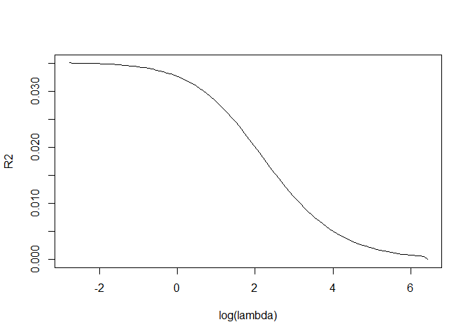

``` r
source("SRC/utils.R")
library(ggfortify)
```

    ## Loading required package: ggplot2

``` r
library(corrplot)
```

    ## corrplot 0.84 loaded

``` r
library(skimr)
RawATP = read.csv("INPUT/atp_matches_with_stats_2016_17_no_null.csv")

returnList = pprepro_pred(RawATP, drop_draw_size=TRUE)
returnList = splitter_pred(returnList$X, returnList$Y)
Xtrain <- returnList$Xtrain
Ytrain <- returnList$Ytrain
Xtest <- returnList$Xtest
Ytest <- returnList$Ytest
rm(returnList)
train.original <- cbind(Xtrain, data.frame(Ytrain$diff_points))

returnList <- PCA_pred(Xtrain, Ytrain)
train.PCA <- returnList$train.PCA
PCA_object <- returnList$train.PCA_object
rm(returnList)
```

### Shrinkage

#### Try simple Ridge:

``` r
numeric_variables <- unlist(lapply(Xtrain, is.numeric))
factor_variables <- unlist(lapply(Xtrain, is.factor))

# Need to create dummy variables first and use matrices, not dataframes
Xtrain.dummy.matrix <- cbind(as.matrix(Xtrain[, numeric_variables]),
                      model.matrix(~.-1, Xtrain[, factor_variables]))
Ytrain.matrix <- as.matrix(Ytrain$diff_points)

ridgeMod <- glmnet::glmnet(x = Xtrain.dummy.matrix, 
                              y = Ytrain.matrix,
                              alpha = 0)
plot(log(ridgeMod$lambda), ridgeMod$dev.ratio, type = "l", 
     xlab = "log(lambda)", ylab = "R2")
```



Does not makes sense, because Ridge and Lasso decrease R2 to have a more
general model. But we have the problem of poor predictors. (I put here
code for Ridge with CV, but it does not makes sense)

``` r
kcvRidge <- glmnet::cv.glmnet(x = Xtrain.dummy.matrix,
                              y = Ytrain.matrix,
                              alpha = 0, nfolds = 5)

Xtrain.PCA.dummy.matrix <- cbind(model.matrix(~.-1,
                                              Xtrain[, factor_variables]),
                                 as.matrix(data.frame(PCA_object$scores)))

kcvRidgePCA <- glmnet::cv.glmnet(x = Xtrain.PCA.dummy.matrix,
                                 y = Ytrain.matrix,
                                 alpha = 0, nfolds = 5)
```

<br />

#### Try Lasso to select predictors

(have here first a simple Lasso model just to have the code):

``` r
lassoMod <- glmnet::glmnet(x = Xtrain.dummy.matrix,
                           y = Ytrain.matrix,
                           alpha = 1)
```

<br />

Now, Lasso to select predictors. First, original predictos:

``` r
kcvLasso <- glmnet::cv.glmnet(x = Xtrain.dummy.matrix,
                              y = Ytrain.matrix, 
                              alpha = 1, nfolds = 5)

modLassoCV <- kcvLasso$glmnet.fit

selPreds <- predict(modLassoCV, type = "coefficients",
                    s = c(kcvLasso$lambda.min, kcvLasso$lambda.1se))[-1, ] > 0

x1 <- Xtrain.dummy.matrix[, selPreds[, 1]]
predictors.original.Lasso <- colnames(x1)
```

Now, with PCA predictors:

``` r
kcvLassoPCA <- glmnet::cv.glmnet(x = Xtrain.PCA.dummy.matrix,
                                 y = Ytrain.matrix,
                                 alpha = 1, nfolds = 5)

modLassoCVPCA <- kcvLassoPCA$glmnet.fit

selPreds <- predict(modLassoCVPCA, type = "coefficients",
                    s = c(kcvLassoPCA$lambda.min, kcvLassoPCA$lambda.1se))[-1, ] > 0

x1.PCA <- Xtrain.PCA.dummy.matrix[, selPreds[, 1]]
predictors.PCA.Lasso <- colnames(x1.PCA)
```
