    ##                 surface              drap1_size           tourney_level 
    ##                "factor"               "numeric"                "factor" 
    ##                 p1_hand                  p1_age                 p1_rank 
    ##                "factor"               "numeric"               "numeric" 
    ##          p1_rank_points                 p2_hand                  p2_age 
    ##               "numeric"                "factor"               "numeric" 
    ##                 p2_rank          p2_rank_points         p1_win_prob_20w 
    ##               "numeric"               "numeric"               "numeric" 
    ##         p1_ace_prob_20w          p1_df_prob_20w     p1_svptWon_prob_20w 
    ##               "numeric"               "numeric"               "numeric" 
    ##         p2_win_prob_20w         p2_ace_prob_20w          p2_df_prob_20w 
    ##               "numeric"               "numeric"               "numeric" 
    ##     p2_svptWon_prob_20w p1_surface_win_prob_20w p2_surface_win_prob_20w 
    ##               "numeric"               "numeric"               "numeric" 
    ##        diff_rank_points                diff_age               diff_rank 
    ##               "numeric"               "numeric"               "numeric"

<br />

### FIRST DESCRIPTION

``` r
# skim is not thought to be used on a markdown document. Run this on your R console
kable(skim(ATP))
```

First conclusions:

-   p1\_hand: 28 unknown
-   p2\_hand: 38 unknown
-   surface: 8 Nones

``` r
table(ATP$p1_hand)
```

    ## 
    ##    L    R    U 
    ##  720 4102   28

``` r
table(ATP$p2_hand)
```

    ## 
    ##    L    R    U 
    ##  761 4051   38

``` r
table(ATP$p1_win)
```

    ## 
    ##    0    1 
    ## 2606 2244

``` r
table(ATP$surface)
```

    ## 
    ## Carpet   Clay  Grass   Hard   None 
    ##      3   1427    483   2929      8

``` r
table(ATP$tourney_level)
```

    ## 
    ##    A    D    F    G    M 
    ## 2664  214   13  895 1064

<br />

-   tourney\_level: London changes from A to F. Explore this variable.
    Only 13 observations with F tourney\_level, which all correspond to
    the master’s cup in London (there are also 27 observations of a
    tournament in London of category A)

``` r
#write.csv(table(RawATP$tourney_name, RawATP$tourney_level),"tourney_levels.csv")
```

-   diff\_points: small values? At least smaller than expected
-   draw\_size: Should be related to the tournament level.

``` r
table(ATP$drap1_size, ATP$tourney_level)
```

    ##      
    ##          A    D    F    G    M
    ##   4      0  214    0    0    0
    ##   8      7    0   13    0    0
    ##   32  2319    0    0    0    0
    ##   64   338    0    0    0  698
    ##   128    0    0    0  895  366

<br />

-   p1\_age: ~normal distribution, no negative values, maximum in 39,
    minumun in 17 -&gt; ok
-   p2\_age: ~normal distribution, no negative values, maximum in 39,
    minumun in 17 -&gt; ok
-   p1\_rank: exponential distribution, no negative values
-   p2\_rank: exponential distribution, no negative values

``` r
hist(ATP$p1_age, breaks = 20)
```

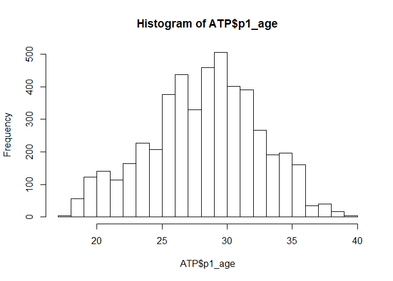

``` r
hist(ATP$p2_age, breaks = 20)
```

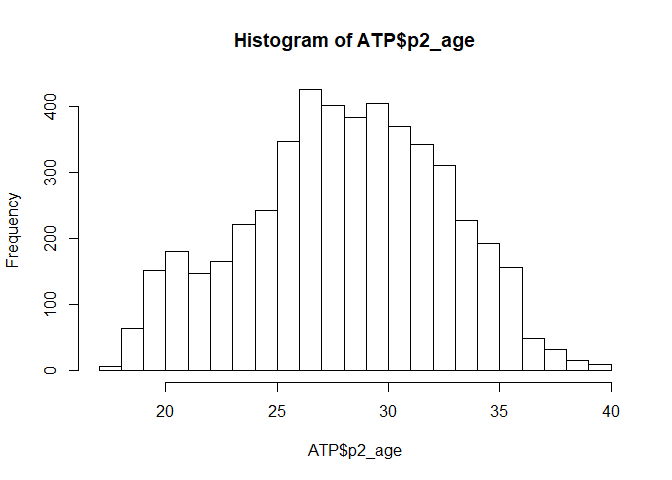

``` r
hist(ATP$p1_rank, breaks = 100)
```

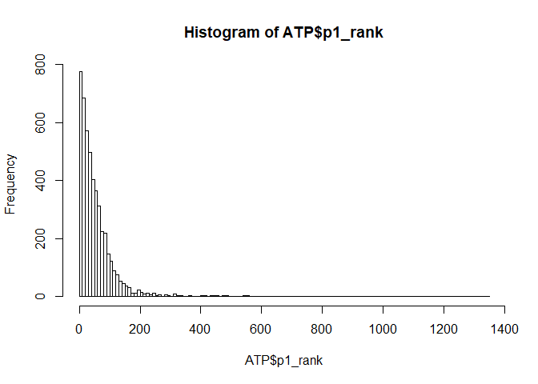

``` r
hist(ATP$p2_rank, breaks = 100)
```


We may consider to log-transform the player rankings, to obtain a more
Gaussian distribution.

<br />

-   p1\_rank\_points: exponential? gamma?log-transform.
-   p2\_rank\_points: exponential? gamma? log-transform.

``` r
fit1_gamma = fitdist(ATP$p1_rank_points,"gamma",method="mme")
hist(ATP$p1_rank_points, freq = F, main="Histogram of p1_rank_points")
m = max(ATP$p1_rank_points)
grid=seq(0,m,1)
lines(grid,dgamma(grid,fit1_gamma$estimate[1],fit1_gamma$estimate[2]))
```


``` r
print(fit1_gamma$aic)
```

    ## [1] 83879.95

``` r
fit1_exp = fitdist(ATP$p1_rank_points,"exp",method="mme")
hist(ATP$p1_rank_points, freq = F, main="Histogram of p1_rank_points")
m = max(ATP$p1_rank_points)
grid=seq(0,m,1)
lines(grid,dexp(grid,fit1_exp$estimate[1],fit1_exp$estimate[2]))
```


``` r
print(fit1_exp$aic)
```

    ## [1] 83026.19

``` r
fit2_exp = fitdist(ATP$p2_rank_points,"exp",method="mme")
hist(ATP$p2_rank_points, freq = F, main="Histogram of p1_rank_points")
m = max(ATP$p2_rank_points)
grid=seq(0,m,1)
lines(grid,dexp(grid,fit2_exp$estimate[1],fit2_exp$estimate[2]))
```


``` r
print(fit2_exp$aic)
```

    ## [1] 78797.21

<br />

-   p1\_ace\_prob\_20w: small values, more or less normal -&gt; ok
-   p1\_df\_prob\_20w: small values, more or less normal -&gt; ok
-   p1\_surface\_win\_prob\_20w: -&gt; seems ok
-   p1\_svptWon\_prob\_20w: -&gt; seems ok
-   p1\_svptWon\_prob\_20w: -&gt; seems ok

-   p2\_ace\_prob\_20w: small values, more or less normal -&gt; ok
-   p2\_df\_prob\_20w: small values, more or less normal -&gt; ok
-   p2\_surface\_win\_prob\_20w: -&gt; seems ok
-   p2\_svptWon\_prob\_20w: -&gt; seems ok
-   p2\_svptWon\_prob\_20w: -&gt; seems ok

All these probabilities should show a difference between p1 and p2,
because p1 has higher ranking than p2. \_ace and \_svptWon could also be
correlated, somehow.

-   diff\_rank: exponential -&gt; log transform
-   diff\_rank\_points: exponential -&gt; log transform
-   diff\_age: gamma distribution. Decreasing but not exponentially

<br />

### MISSING VALUES

-   p1\_hand: 28 unknown
-   p2\_hand: 38 unknown
-   surface: 8 Nones

Input p1\_hand and p2\_hand unknowns to R level (most common class)
Input surface Nones to hard (most common class) Input Carpet surface
(only 3) to Grass (most similar in tennis terms)

``` r
ATP[ATP$p1_hand == 'U',]$p1_hand <- 'R'
ATP[ATP$p2_hand == 'U',]$p2_hand <- 'R'
ATP[ATP$surface == 'None',]$surface <- 'Hard'
ATP[ATP$surface == 'Carpet',]$surface <- 'Grass'

ATP$p1_hand = droplevels(ATP$p1_hand, except = c('R', 'L'))
ATP$p2_hand = droplevels(ATP$p2_hand, except = c('R', 'L'))
ATP$surface = droplevels(ATP$surface)

table(ATP$p1_hand)
```

    ## 
    ##    L    R 
    ##  720 4130

``` r
table(ATP$p2_hand)
```

    ## 
    ##    L    R 
    ##  761 4089

``` r
table(ATP$surface)
```

    ## 
    ##  Clay Grass  Hard 
    ##  1427   486  2937

### RELATIONSHIPS BETWEEN VARIABLES

<br />

#### Relationships between continuous variables

``` r
# Log scale exponential predictors
ATP.Predictors$p1_rank = log(ATP.Predictors$p1_rank)
ATP.Predictors$p2_rank = log(ATP.Predictors$p2_rank)
ATP.Predictors$p1_rank_points = log(ATP.Predictors$p1_rank_points)
ATP.Predictors$p2_rank_points = log(ATP.Predictors$p2_rank_points)
ATP.Predictors$diff_rank = log(ATP.Predictors$diff_rank)

# I have to add .5 to the diff_rank_points in order not to have -Inf in the log
ATP.Predictors$diff_rank_points = log(ATP.Predictors$diff_rank_points + 0.5)

# Add output variables to plot them with the numerical predictors
ATP.Predictors["diff_points"] <- ATP$diff_points
ATP.Predictors["p1_win"] <- ATP$p1_win

# I have to divide this mega-plot because all variables do not fit in one plot
nums.Predictors <- unlist(lapply(ATP.Predictors, is.numeric))

print(colnames(ATP.Predictors[,nums.Predictors]))
```

    ##  [1] "drap1_size"              "p1_age"                 
    ##  [3] "p1_rank"                 "p1_rank_points"         
    ##  [5] "p2_age"                  "p2_rank"                
    ##  [7] "p2_rank_points"          "p1_win_prob_20w"        
    ##  [9] "p1_ace_prob_20w"         "p1_df_prob_20w"         
    ## [11] "p1_svptWon_prob_20w"     "p2_win_prob_20w"        
    ## [13] "p2_ace_prob_20w"         "p2_df_prob_20w"         
    ## [15] "p2_svptWon_prob_20w"     "p1_surface_win_prob_20w"
    ## [17] "p2_surface_win_prob_20w" "diff_rank_points"       
    ## [19] "diff_age"                "diff_rank"              
    ## [21] "diff_points"

``` r
pn1 <- ggpairs(data=ATP.Predictors, columns = c(colnames(ATP.Predictors[,nums.Predictors])[2:11],
                                     "diff_points"),
               title="Numeric variables 2-11 + diff_points", 
               mapping=ggplot2::aes(colour = ATP.Predictors$p1_win, alpha = 0.7))
pn1
```

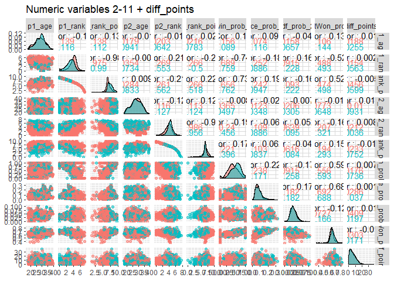

``` r
pn2 <- ggpairs(data=ATP.Predictors, columns = c(colnames(ATP.Predictors[,nums.Predictors])[2:6],
                                    colnames(ATP.Predictors[,nums.Predictors])[11:15]),
               title="Numeric variables 2-6,11-15", 
               mapping=ggplot2::aes(colour = ATP.Predictors$p1_win, alpha = 0.7))
pn2
```

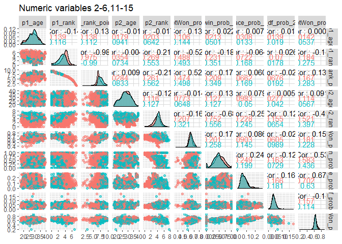

``` r
pn3 <- ggpairs(data=ATP.Predictors, columns = c(colnames(ATP.Predictors[,nums.Predictors])[2:6],
                                     colnames(ATP.Predictors[,nums.Predictors])[16:19]),
               title="Numeric variables 2-6,16-19", 
               mapping=ggplot2::aes(colour = ATP.Predictors$p1_win, alpha = 0.7))
pn3
```

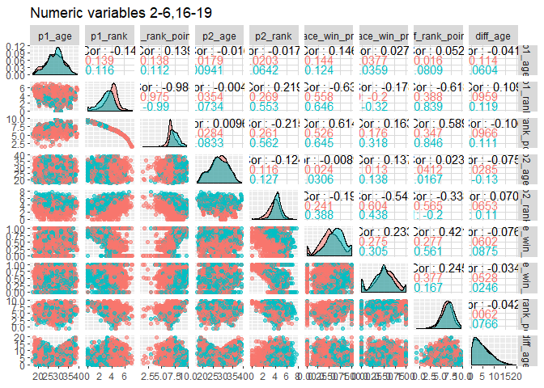

``` r
pn4 <- ggpairs(data=ATP.Predictors, columns = c(colnames(ATP.Predictors[,nums.Predictors])[7:15]),
               title="Numeric variables 7-15", 
               mapping=ggplot2::aes(colour = ATP.Predictors$p1_win, alpha = 0.7))
pn4
```

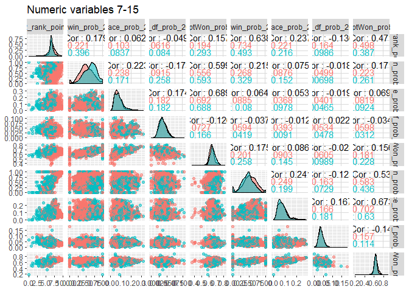

``` r
pn5 <- ggpairs(data=ATP.Predictors, columns = c(colnames(ATP.Predictors[,nums.Predictors])[7:11],
                                     colnames(ATP.Predictors[,nums.Predictors])[16:19]),
               title="Numeric variables 7-11,16-19",
               mapping=ggplot2::aes(colour = ATP.Predictors$p1_win, alpha = 0.7))
pn5
```

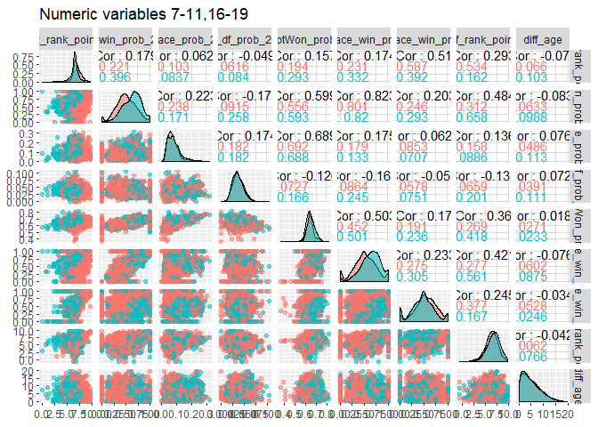

``` r
pn6 <- ggpairs(data=ATP.Predictors, columns = c(colnames(ATP.Predictors[,nums.Predictors])[11:19],
                                     "diff_points"),
               title="Numeric variables 11-19 + diff_points",
               mapping=ggplot2::aes(colour = ATP.Predictors$p1_win, alpha = 0.7))
pn6
```

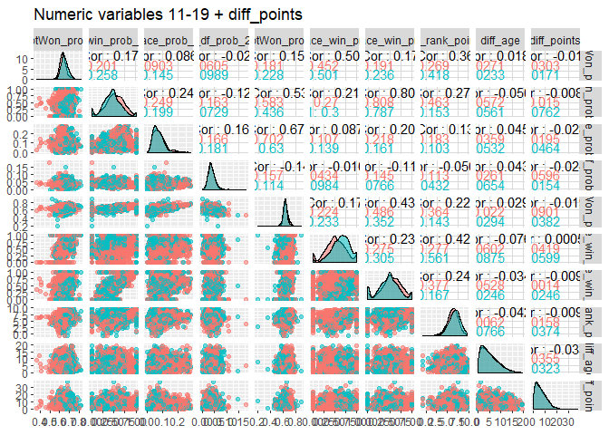

``` r
# Remove output variables
ATP.Predictors["diff_points"] <- NULL
ATP.Predictors["p1_win"] <- NULL
```

<br />

###### Correlation

There are several variables highly correlated:

-   p1\_rank & p1\_rank\_points -&gt; 0.98
-   p1\_rank $ p2\_rank\_points -&gt; 0.97
-   p1\_surface\_win\_prob\_20w & p1\_win\_prob\_20w -&gt; 0.82
-   p2\_surface\_win\_prob\_20w & p2\_win\_prob\_20w -&gt; 0.8
-   p1\_rank & p1\_win\_prob\_20w -&gt; 0.74
-   p1\_rank\_points & p1\_win\_prob\_20w -&gt; 0.73

Others show moderate linear correlation:

-   p2\_rank & p2\_win\_prob\_20w -&gt; 0.65
-   p2\_rank\_points & p2\_win\_prob\_20w -&gt; 0.63
-   p1\_svptWon\_prob\_20w & p1\_ace\_prob\_20w -&gt; 0.68
-   p2\_svptWon\_prob\_20w & p2\_ace\_prob\_20w -&gt; 0.67

But most of the continuous variables are uncorrelated.

-   **WEIRD**! Strong correlation between diff\_rank\_points and
    p1\_rank\_points for p1\_win == 0 (0.84), but not for p1\_win == 1
    (0.34). More or less strong correlation between p2\_win\_prob\_20w
    and p2\_rank\_points for p1\_win == 0 (0.73), but not for p1\_win ==
    1 (0.5). More or less strong correlation between diff\_rank\_points
    and p2\_rank\_points for p1\_win == 0 (0.53), but not for p1\_win ==
    1 (0.16). CHECK COLORS!

<br />

###### Interesting remarks from scatter plots

-   The scatter plots of variable p2\_svptWon\_prob\_20w (15) are always
    close to an horizontal line. This effect is less strong for
    p1\_svptWon\_prob\_20w (11).

-   p2\_rank\_points (7) seems to divide more or less well the p1\_win
    variable, with higher values of p2\_rank\_points (7) corresponding
    to p1\_win == 1 and smaller ones to p1\_win == 0.

<br />

###### Interesting remarks from distributions

-   p1\_rank, p1\_surface\_win\_prob\_20w and p1\_win\_prob\_20w behave
    slightly different for the two values of p1\_win: the distribution
    of these variables do not completely overlap for the two values of
    p1\_win.

<br />

#### Relationships between continuous variables and diff-points

Already in upper plots

<br />

#### Relationships between categorical variables and diff\_points

Boxplots of diff\_points by categories

``` r
ggplot2::ggplot(ATP, aes(x=p1_hand, y=diff_points, color=p1_hand)) +
  geom_boxplot()
```

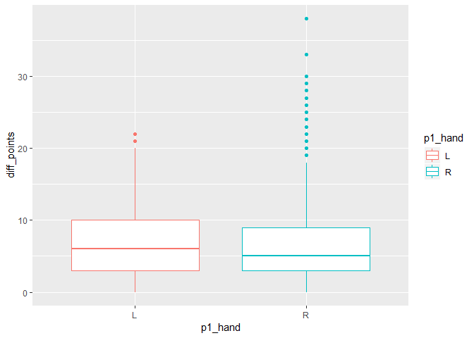

``` r
ggplot2::ggplot(ATP, aes(x=p2_hand, y=diff_points, color=p2_hand)) +
  geom_boxplot()
```

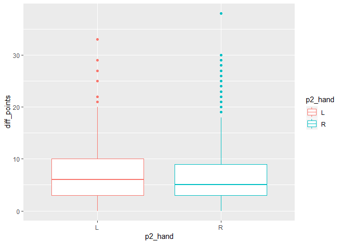

``` r
ggplot2::ggplot(ATP, aes(x=surface, y=diff_points, color=surface)) +
  geom_boxplot()
```

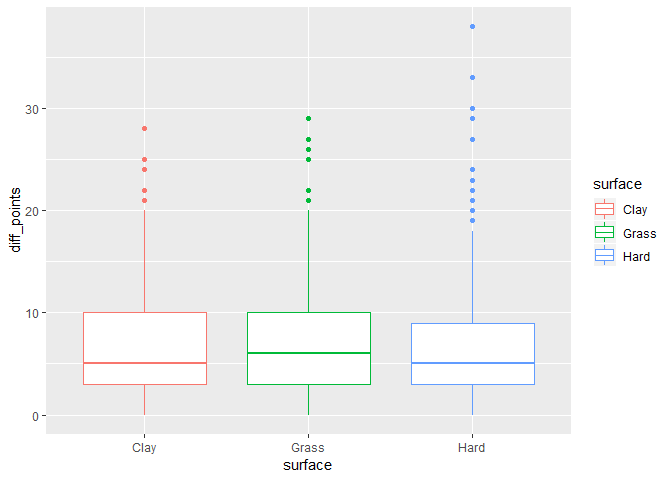

``` r
ggplot2::ggplot(ATP, aes(x=tourney_level, y=diff_points, color=tourney_level)) +
  geom_boxplot()
```

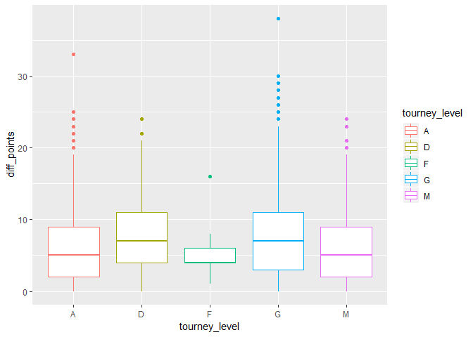

There is more difference in points in Grass mathces than in hard and
Clay (in the mean), but the boxplot overlap is very high.

With respect to the tourney level, the means of the difference in points
is higher for Grand Slam matches and Davis Cup matches, but in 2016 and
2017 (the years from where the data comes from) Davis Cup and Grand Slam
matches were played up to 5 sets, so this is reasonable.

In Tourney\_level: + A: All other mathces (smaller championships, etc.)
+ D: Davis Cups + F: finals (masters cup in London -&gt; 13 matches) +
G: Grand Slam + M: master 1000

<br />

#### Relationships between continuous variables and p1\_win

Already in upper plots (color is p1\_win)

<br />

#### Relationships between categorical variables and p1\_win

Barplots of categorical variables by p1\_win

``` r
attach(ATP)
df_1 = data.frame(table(p1_win[p1_hand == "R"]), "R")
colnames(df_1) = c("p1_win", "Count", "p1_hand")
df_2 = data.frame(table(p1_win[p1_hand == "L"]), "L")
colnames(df_2) = c("p1_win", "Count", "p1_hand")
dftotal = rbind(df_2, df_1)
p1 <- ggplot(data=dftotal, aes(x=p1_win, y=Count, fill=p1_hand)) +
  geom_col(position = position_dodge2(width = 0.9, preserve = "single")) 
p1
```

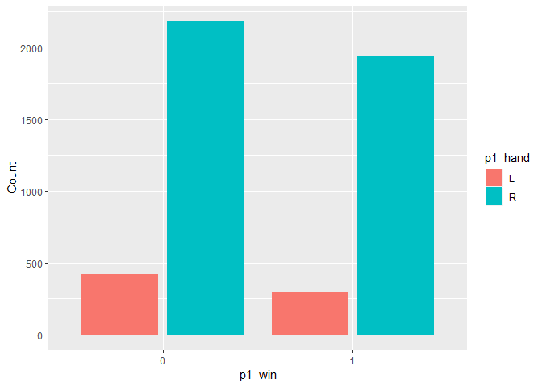

``` r
df_1 = data.frame(table(p1_win[p2_hand == "R"]), "R")
colnames(df_1) = c("p1_win", "Count", "p2_hand")
df_2 = data.frame(table(p1_win[p2_hand == "L"]), "L")
colnames(df_2) = c("p1_win", "Count", "p2_hand")
dftotal = rbind(df_2, df_1)
p2 <- ggplot(data=dftotal, aes(x=p1_win, y=Count, fill=p2_hand)) +
  geom_col(position = position_dodge2(width = 0.9, preserve = "single")) 
p2
```

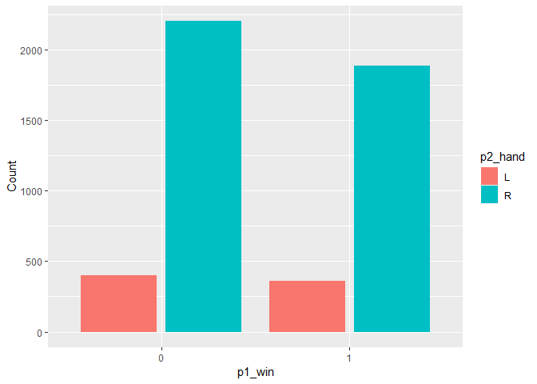

``` r
df_1 = data.frame(table(p1_win[surface == "Clay"]), "Clay")
colnames(df_1) = c("p1_win", "Count", "surface")
df_2 = data.frame(table(p1_win[surface == "Grass"]), "Grass")
colnames(df_2) = c("p1_win", "Count", "surface")
df_3 = data.frame(table(p1_win[surface == "Hard"]), "Hard")
colnames(df_3) = c("p1_win", "Count", "surface")
dftotal = rbind(df_2, df_1, df_3)
p3 <- ggplot(data=dftotal, aes(x=p1_win, y=Count, fill=surface)) +
  geom_col(position = position_dodge2(width = 0.9, preserve = "single")) 
p3
```

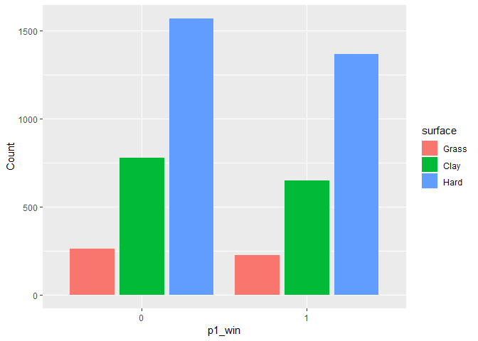

``` r
table(surface[p1_win == 0])/dim(ATP[ATP$p1_win == 0,])[1]
```

    ## 
    ##       Clay      Grass       Hard 
    ## 0.29815810 0.09976976 0.60207214

``` r
table(surface[p1_win == 1])/dim(ATP[ATP$p1_win == 1,])[1]
```

    ## 
    ##      Clay     Grass      Hard 
    ## 0.2896613 0.1007130 0.6096257

There is not significant difference in the proportion of p1\_wins
depending on the hand or surface.

<br />

#### Relationships between categorical variables

Group bar plots

``` r
pgrey <- ggpairs(data=ATP, columns = c("p1_win", "p1_hand", "surface", "p2_hand", "tourney_level"), title="Categorical variables", mapping=ggplot2::aes(alpha = 0.9, position="dodge2"))
pgrey
```

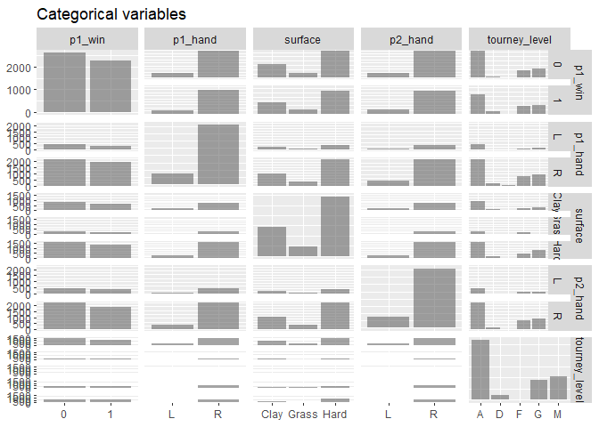

<br />
