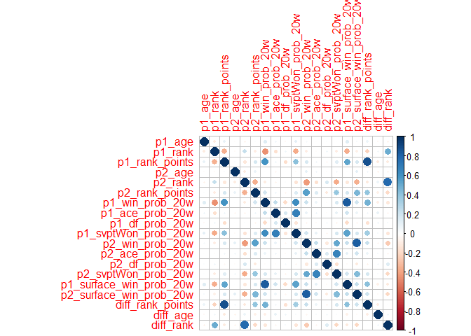
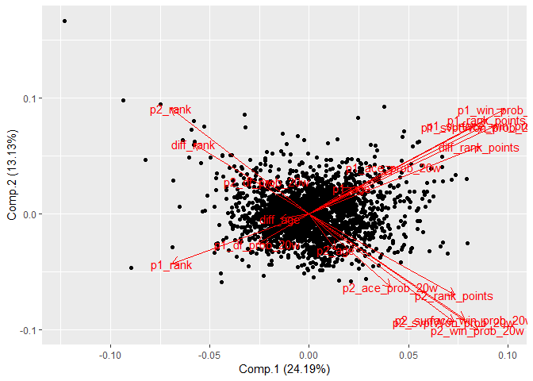
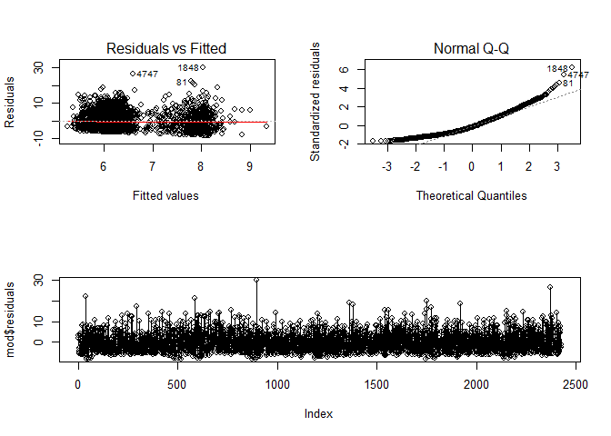
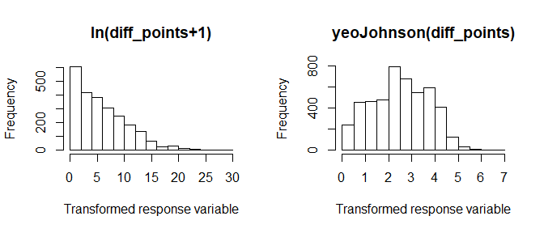

Simple Regression notebook
==========================

Introduction
------------

To study simple regression models, we make use of a very extense dataset
full of tennis matches taken from a [GitHub
repository](https://github.com/JeffSackmann/tennis_atp). This repository
gathers ATP Tennis rankings, results, and stats from 1968 to 2018. For
every match, we have information about different variables that might
impact in the final result: ATP rank of both players, surface type,
tournament, effectiveness with first and second service, etc.

A preprocessing in Python was done to create two target variables: who
wins the match and the difference in points at the end of the match.
Also, new variables were created using information of the last 20
matches prior to the match for each observation and we variables that
are not supposed to be known before the match takes place were removed.
All the preprocessing and the column description of the dataset can be
found in this [Jupyter
notebook](https://gist.github.com/franloza/7e63d5875a23e310501c48f88f9629a1).

In this experiment, only the difference in points was used as the target
variable and not the winner of the match,

<br />

<br />

Preprocessing
-------------

After a descriptive analysis (check descriptive\_statistics.md), it was
decided that the transformations to apply to the dataset were: - Set
categorical variables as factors in R. - Create 3 new variables: age
difference, rank difference and points difference. - Substitute missing
and uncommon values by the mode (in categorical predictors). Wrong and
uncommon values may introduce noise in the data and increase the error
of our model, so we need to deal with them. The observations with NULL
values were drop in the preprocessing done before the experiment, so we
only need to replace masked NULLs as strings. - Apply the logarithm of a
variable. Looking at the histograms, we can check if a variable is
right-skewed. Applying the logarithm can help to reduce this skewness
and avoid that few observations have a high influence in the regression.
- Centring and scaling. This way, the obtained coefficients of the
regression are no longer influenced by the magnitudes of the variables.
- Remove high-leverage points. It is likely to find predictors that are
very far away from the rest of the points. To reduce the impact of these
observations, we decided to remove the observations that are detected as
a high-leverage point using the *χ*<sub>*p*</sub><sup>2</sup>
distribution with *α* equal to 0.01.

In addition, we randomly splitted the dataset into train and test.

These two tasks are done in the custom functions pprepro\_pred and
splitter\_pred, from utils.R

``` r
source("SRC/utils.R")
library(dplyr)
library(ggfortify)
library(corrplot)
library(skimr)
RawATP = read.csv("INPUT/atp_matches_with_stats_2016_17_no_null.csv")
returnList = pprepro_pred(RawATP)
returnList = splitter_pred(returnList$X, returnList$Y)
```

Note: We removed around 8% of the data set as outliers.

<br />

<br />

### First model

In order to create the multilinear model for the difference in points we
will start performing the simpliest model. This will give us a starting
point. This model will simply use all the predictors available in our
dataset therefore given us a first intuition of the predictors that are
more useful.

``` r
Xtrain <- returnList$Xtrain
Ytrain <- returnList$Ytrain
Xtest <- returnList$Xtest
Ytest <- returnList$Ytest
rm(returnList)
train.original <- cbind(Xtrain, data.frame(Ytrain$diff_points))
mod <- lm(Ytrain.diff_points ~ ., data = train.original)
summary(mod)
```

    ## 
    ## Call:
    ## lm(formula = Ytrain.diff_points ~ ., data = train.original)
    ## 
    ## Residuals:
    ##     Min      1Q  Median      3Q     Max 
    ## -9.4171 -3.6530 -0.9279  2.9519 21.2020 
    ## 
    ## Coefficients: (1 not defined because of singularities)
    ##                           Estimate Std. Error t value Pr(>|t|)   
    ## (Intercept)              4.4421889  3.9590561   1.122  0.26196   
    ## surfaceGrass            -0.2022254  0.3798032  -0.532  0.59447   
    ## surfaceHard             -0.1592118  0.2382504  -0.668  0.50404   
    ## tourney_levelD           1.8935931  0.7576490   2.499  0.01251 * 
    ## tourney_levelF          -3.1068540  3.3222175  -0.935  0.34979   
    ## tourney_levelG           1.8467939  0.6238640   2.960  0.00310 **
    ## tourney_levelM           0.1434324  0.4539188   0.316  0.75204   
    ## p1_handR                 0.2583467  0.2906080   0.889  0.37410   
    ## p1_age                   0.0471308  0.0235726   1.999  0.04568 * 
    ## p1_rank                  0.0044837  0.0016268   2.756  0.00589 **
    ## p1_rank_points           0.0001673  0.0001112   1.505  0.13255   
    ## p2_handR                 0.0672704  0.2676939   0.251  0.80161   
    ## p2_age                   0.0053353  0.0225783   0.236  0.81322   
    ## p2_rank                  0.0023458  0.0015943   1.471  0.14132   
    ## p2_rank_points           0.0001807  0.0001043   1.734  0.08311 . 
    ## p1_win_prob_20w          0.2704786  0.9953707   0.272  0.78585   
    ## p1_ace_prob_20w          2.2303532  3.4723416   0.642  0.52073   
    ## p1_df_prob_20w          11.9009220  8.7070223   1.367  0.17181   
    ## p1_svptWon_prob_20w     -2.0420832  4.7815652  -0.427  0.66936   
    ## p2_win_prob_20w          0.4860765  0.9172709   0.530  0.59622   
    ## p2_ace_prob_20w         -2.3854262  3.4031208  -0.701  0.48340   
    ## p2_df_prob_20w          -4.8104183  7.9089886  -0.608  0.54310   
    ## p2_svptWon_prob_20w      0.5076985  4.2154140   0.120  0.90415   
    ## p1_surface_win_prob_20w -0.1109553  0.7557268  -0.147  0.88329   
    ## p2_surface_win_prob_20w -0.3123609  0.7164046  -0.436  0.66287   
    ## draw_size8               0.2114279  2.8577568   0.074  0.94103   
    ## draw_size32              0.0895365  0.5950679   0.150  0.88041   
    ## draw_size64              0.0722493  0.4438426   0.163  0.87070   
    ## draw_size128                    NA         NA      NA       NA   
    ## diff_rank_points        -0.0001946  0.0001170  -1.663  0.09637 . 
    ## diff_age                -0.0404379  0.0271303  -1.491  0.13622   
    ## diff_rank               -0.0024661  0.0017410  -1.416  0.15677   
    ## ---
    ## Signif. codes:  0 '***' 0.001 '**' 0.01 '*' 0.05 '.' 0.1 ' ' 1
    ## 
    ## Residual standard error: 4.792 on 2394 degrees of freedom
    ## Multiple R-squared:  0.03513,    Adjusted R-squared:  0.02304 
    ## F-statistic: 2.906 on 30 and 2394 DF,  p-value: 2.509e-07

We wanted to explore the collinearity of the model. To do so we intend
to compute the Variance Inflation Factor, which measures how linearly
dependent is Xj on the rest of the predictors. However, we can’t compute
the VIF because we get large coefficients.

Explanation: NA as a coefficient in a regression indicates that the
variable in question is linearly related to the other variables. In your
case, this means that Q3=a×Q1+b×Q2+c for some a,b,c. If this is the
case, then there’s no unique solution to the regression without dropping
one of the variables. Adding Q4 is only going to make matters worse.
That is becase the draw\_size is linearly related with the tourney
level, so we will repeat the preprocessing removing the variable
draw\_size.

``` r
table(train.original$draw_size, train.original$tourney_level)
```

    ##      
    ##          A    D    F    G    M
    ##   4      0  109    0    0    0
    ##   8      3    0    7    0    0
    ##   32  1122    0    0    0    0
    ##   64   175    0    0    0  346
    ##   128    0    0    0  467  196

``` r
# We generate the datasets again without the variable Draw Size, which is linearly
# dependent with Tourney Level
returnList = pprepro_pred(RawATP, drop_draw_size=TRUE)
returnList = splitter_pred(returnList$X, returnList$Y)
Xtrain <- returnList$Xtrain
Ytrain <- returnList$Ytrain
Xtest <- returnList$Xtest
Ytest <- returnList$Ytest
rm(returnList)
train.original <- cbind(Xtrain, data.frame(Ytrain$diff_points))
mod <- lm(Ytrain.diff_points ~ ., data = train.original)
car::vif(mod) 
```

    ##                             GVIF Df GVIF^(1/(2*Df))
    ## surface                 1.227756  2        1.052636
    ## tourney_level           1.508253  4        1.052711
    ## p1_hand                 1.051139  1        1.025251
    ## p1_age                  1.059806  1        1.029469
    ## p1_rank                 2.022108  1        1.422008
    ## p1_rank_points          7.540750  1        2.746043
    ## p2_hand                 1.034148  1        1.016931
    ## p2_age                  1.039066  1        1.019346
    ## p2_rank                 3.752484  1        1.937133
    ## p2_rank_points          2.334182  1        1.527803
    ## p1_win_prob_20w         4.672195  1        2.161526
    ## p1_ace_prob_20w         2.524185  1        1.588768
    ## p1_df_prob_20w          1.193233  1        1.092352
    ## p1_svptWon_prob_20w     3.706327  1        1.925182
    ## p2_win_prob_20w         3.982631  1        1.995653
    ## p2_ace_prob_20w         2.179170  1        1.476201
    ## p2_df_prob_20w          1.207116  1        1.098689
    ## p2_svptWon_prob_20w     2.826488  1        1.681216
    ## p1_surface_win_prob_20w 3.486024  1        1.867090
    ## p2_surface_win_prob_20w 3.272615  1        1.809037
    ## diff_rank_points        7.234311  1        2.689667
    ## diff_age                1.054134  1        1.026710
    ## diff_rank               4.012024  1        2.003004

We see in the VIF computation that there are multiple values with a VIF
larger than 5, which indicates that there are linear relations among
some variables. We decide to explore the correlation of the variables to
obtain an insight into these relationships.

``` r
numeric_variables <- unlist(lapply(Xtrain, is.numeric))
corrplot(cor(Xtrain[,numeric_variables]))
```



We find several variables highly correlated such as *p1\_rank* with
*p1\_rank\_points* or *p1\_surface\_win\_prob\_20w* with
*p1\_win\_prob\_20w* among others. We decide to apply Principal
Component Analysis(PCA) to obtain orthogonal predictors which are no
longer correlated. This approach might also increase the power of the
model, which is extremely low:

``` r
summary(mod)
```

    ## 
    ## Call:
    ## lm(formula = Ytrain.diff_points ~ ., data = train.original)
    ## 
    ## Residuals:
    ##     Min      1Q  Median      3Q     Max 
    ## -9.4210 -3.6505 -0.9218  2.9656 21.2023 
    ## 
    ## Coefficients:
    ##                           Estimate Std. Error t value Pr(>|t|)    
    ## (Intercept)              4.5184626  3.9222814   1.152 0.249437    
    ## surfaceGrass            -0.2079368  0.3779432  -0.550 0.582247    
    ## surfaceHard             -0.1679897  0.2319193  -0.724 0.468924    
    ## tourney_levelD           1.8076442  0.5162844   3.501 0.000472 ***
    ## tourney_levelF          -2.9901788  1.9091515  -1.566 0.117426    
    ## tourney_levelG           1.7585593  0.2674960   6.574 5.98e-11 ***
    ## tourney_levelM           0.1015166  0.2545616   0.399 0.690084    
    ## p1_handR                 0.2608011  0.2900334   0.899 0.368631    
    ## p1_age                   0.0472225  0.0235513   2.005 0.045066 *  
    ## p1_rank                  0.0044795  0.0016251   2.756 0.005889 ** 
    ## p1_rank_points           0.0001683  0.0001107   1.521 0.128481    
    ## p2_handR                 0.0683083  0.2672599   0.256 0.798291    
    ## p2_age                   0.0054577  0.0225526   0.242 0.808801    
    ## p2_rank                  0.0023406  0.0015924   1.470 0.141741    
    ## p2_rank_points           0.0001821  0.0001035   1.760 0.078551 .  
    ## p1_win_prob_20w          0.2709058  0.9943360   0.272 0.785300    
    ## p1_ace_prob_20w          2.2380367  3.4653620   0.646 0.518451    
    ## p1_df_prob_20w          11.9781343  8.6841404   1.379 0.167927    
    ## p1_svptWon_prob_20w     -2.0278849  4.7734771  -0.425 0.671004    
    ## p2_win_prob_20w          0.4875741  0.9164434   0.532 0.594755    
    ## p2_ace_prob_20w         -2.3709250  3.3979432  -0.698 0.485399    
    ## p2_df_prob_20w          -4.8535552  7.8961062  -0.615 0.538826    
    ## p2_svptWon_prob_20w      0.4966838  4.2121135   0.118 0.906143    
    ## p1_surface_win_prob_20w -0.1085800  0.7548195  -0.144 0.885632    
    ## p2_surface_win_prob_20w -0.3154761  0.7152234  -0.441 0.659189    
    ## diff_rank_points        -0.0001957  0.0001165  -1.680 0.093125 .  
    ## diff_age                -0.0402988  0.0270825  -1.488 0.136882    
    ## diff_rank               -0.0024576  0.0017392  -1.413 0.157767    
    ## ---
    ## Signif. codes:  0 '***' 0.001 '**' 0.01 '*' 0.05 '.' 0.1 ' ' 1
    ## 
    ## Residual standard error: 4.789 on 2397 degrees of freedom
    ## Multiple R-squared:  0.03512,    Adjusted R-squared:  0.02425 
    ## F-statistic: 3.232 on 27 and 2397 DF,  p-value: 4.279e-08

Looking at the results of this first model we can see that we have many
issues. First of all, we have obtained an R2 really low (0,0201), and
consequently the prediction power of the model is almost insignificant
(assuming that the conditions for a multilinear model to work properly
are verified, which is something we have not test yet). Apart from that,
we can see that all variables seem to have no impact in the prediction
of the response, as all of them have very high p-values. However, we
might be suffering from collinearity in the quantiative variables, so
there is a chance that lowering the number of predictors will help in
this aspect. Let’s try to apply PCA to reduce that number and also a
stepwise procedure to select less predictors. The main objective of both
things is to obtain a model with less predictors but all of them
significant.

<br />

<br />

### PCA, stepwise model selection and interactions.

<br />

#### PCA

We will transform the numerical variables to a new dimensional space
with PCA to obtain uncorrelated variables. In addition, we will add to
this new set of predictors the categorical variables; because it is does
not have much sense from a theoretical perspective to include them in
the PCA.

All of this is done inside the function PCA\_pred (from utils.R).

``` r
returnList <- PCA_pred(Xtrain, Ytrain)
train.PCA <- returnList$train.PCA
train.PCA_object <- returnList$train.PCA_object
rm(returnList)

summary(train.PCA)
```

    ##   surface     tourney_level p1_hand  p2_hand      Comp.1        
    ##  Clay : 679   A:1300        L: 332   L: 397   Min.   :-13.0052  
    ##  Grass: 235   D: 109        R:2093   R:2028   1st Qu.: -1.3491  
    ##  Hard :1511   F:   7                          Median : -0.1798  
    ##               G: 467                          Mean   :  0.0000  
    ##               M: 542                          3rd Qu.:  1.2673  
    ##                                               Max.   :  8.3976  
    ##      Comp.2            Comp.3             Comp.4        
    ##  Min.   :-4.5491   Min.   :-13.3961   Min.   :-4.31221  
    ##  1st Qu.:-0.9737   1st Qu.: -0.3905   1st Qu.:-0.76240  
    ##  Median :-0.1152   Median :  0.2563   Median :-0.06684  
    ##  Mean   : 0.0000   Mean   :  0.0000   Mean   : 0.00000  
    ##  3rd Qu.: 0.8909   3rd Qu.:  0.7375   3rd Qu.: 0.61820  
    ##  Max.   :12.9592   Max.   :  2.4418   Max.   : 6.50557  
    ##      Comp.5             Comp.6              Comp.7       
    ##  Min.   :-6.90150   Min.   :-3.244207   Min.   :-3.0290  
    ##  1st Qu.:-0.63540   1st Qu.:-0.657487   1st Qu.:-0.6826  
    ##  Median : 0.03591   Median :-0.004185   Median : 0.0675  
    ##  Mean   : 0.00000   Mean   : 0.000000   Mean   : 0.0000  
    ##  3rd Qu.: 0.62966   3rd Qu.: 0.667960   3rd Qu.: 0.7214  
    ##  Max.   : 4.80338   Max.   : 4.450798   Max.   : 3.4435  
    ##      Comp.8             Comp.9            Comp.10        
    ##  Min.   :-4.08575   Min.   :-3.93640   Min.   :-6.08865  
    ##  1st Qu.:-0.66154   1st Qu.:-0.58281   1st Qu.:-0.60022  
    ##  Median :-0.04462   Median : 0.07709   Median : 0.03534  
    ##  Mean   : 0.00000   Mean   : 0.00000   Mean   : 0.00000  
    ##  3rd Qu.: 0.54821   3rd Qu.: 0.64133   3rd Qu.: 0.64941  
    ##  Max.   : 3.73845   Max.   : 2.96344   Max.   : 3.40664  
    ##     Comp.11            Comp.12           Comp.13        
    ##  Min.   :-4.26149   Min.   :-7.1778   Min.   :-5.09327  
    ##  1st Qu.:-0.52175   1st Qu.:-0.2334   1st Qu.:-0.33676  
    ##  Median :-0.01445   Median :-0.0327   Median : 0.01059  
    ##  Mean   : 0.00000   Mean   : 0.0000   Mean   : 0.00000  
    ##  3rd Qu.: 0.52960   3rd Qu.: 0.1953   3rd Qu.: 0.36811  
    ##  Max.   : 4.35446   Max.   : 5.4283   Max.   : 3.47214  
    ##     Comp.14            Comp.15            Comp.16         
    ##  Min.   :-5.43994   Min.   :-2.82553   Min.   :-3.347027  
    ##  1st Qu.:-0.28037   1st Qu.:-0.25883   1st Qu.:-0.224830  
    ##  Median :-0.00101   Median : 0.01006   Median :-0.001925  
    ##  Mean   : 0.00000   Mean   : 0.00000   Mean   : 0.000000  
    ##  3rd Qu.: 0.28352   3rd Qu.: 0.27107   3rd Qu.: 0.225964  
    ##  Max.   : 2.88858   Max.   : 2.37282   Max.   : 1.970311  
    ##     Comp.17            Comp.18             Comp.19        
    ##  Min.   :-2.29320   Min.   :-2.638151   Min.   :-4.39319  
    ##  1st Qu.:-0.16601   1st Qu.:-0.198701   1st Qu.:-0.07070  
    ##  Median :-0.02038   Median : 0.006271   Median : 0.01604  
    ##  Mean   : 0.00000   Mean   : 0.000000   Mean   : 0.00000  
    ##  3rd Qu.: 0.13878   3rd Qu.: 0.198269   3rd Qu.: 0.10113  
    ##  Max.   : 7.06885   Max.   : 2.941225   Max.   : 1.51949  
    ##  Ytrain.diff_points
    ##  Min.   : 0.000    
    ##  1st Qu.: 3.000    
    ##  Median : 5.000    
    ##  Mean   : 6.395    
    ##  3rd Qu.: 9.000    
    ##  Max.   :29.000

With the first 3 components we can explain more than the 50% per cent of
the variance of the dataset and with 10 components, more than the 90%.
If we observe the two first components, we see that the first one
differentiates between the position in ranking and the probabilities
whereas the second component is capable of grouping variables belonging
to either player one or player two.

``` r
ggplot2::autoplot(train.PCA_object, label = FALSE, loadings.label = TRUE)
```


<br />

#### Stepwise model selection

Instead of chosing the first PCs, we will apply Stepwise model selection
to those Principal Components. Stepwise selection works by sequentially
adding predictors to the model (or removing them, depending on the
direction) until a best performing model is found. To compare the
different models there two main criteria: AIC and BIC. The selected
information criterion in this work is the Bayesian Information Criterion
(BIC) as it penalizes complex models, which may improve
interpretability.

The custom function stepwise\_pred uses the R function MASS::stepAIC to
perform Stepwise model selection.

``` r
returnList <- stepwise_pred(train.PCA, BIC=TRUE)
model.PCA.AIC <- returnList$model.PCA.AIC
predictors.PCA <- returnList$predictors.PCA
print(predictors.PCA)
```

    ##  [1] "tourney_levelD" "tourney_levelF" "tourney_levelG" "tourney_levelM"
    ##  [5] "Comp.5"         "Comp.6"         "Comp.7"         "Comp.9"        
    ##  [9] "Comp.17"        "Comp.19"

``` r
rm(returnList)
```

<br />

The conclusions we can obtain from the model generated with BIC
procedure is that matches that are played in the David Cup or a Grand
Slam have a significantly positive influence on the difference in the
number of points. This model also tell us that the rest of the variables
are not informative enough for our linear model to predict the
difference in the number of points. This is a very important result, as
it tells us that is going to be very difficult to predict the variable
difference in points in terms of our predictors. As we said before, BIC
stepwise procedure is not infallible, so there is the possibility that
trying a different procedure or performing some transformations on the
variables we might obtain a better model with more predictors. But at
this point it seems that our predictors are not very good to predict the
response variable (the stepwise procedure only selected two factors of
one categorical variable as the significant predictors among 24
variables). The other two factors of the variable tourney are discarded
as their p-values are very high. At this point we should remind that,
for categorical variables in multilinear models, the most common
approach is to binarize all the factors of the variable. In different
models like decision trees this is not needed, as they do not depend on
the magnitudes of the categories, but this is not the case in
“quantitative” models. Therefore, it is possible that only some factors
of the categorical have an impact while the rest do not. Apart from
that, we still have the issue of having a very poor regression
coefficient for the model (Radj = 0.028). At this point, if we are not
able to elevate this coefficient the problems related with collinearity
or model assumptions are almost irrelevant, as the predictions the model
will generate will be very poor. In any case, we will continue with the
analysis for the sake of this academic exercise.

We are now going to apply Stepwise model selection on the original
attributes.

``` r
returnList <- stepwise_pred(train.original, BIC=TRUE)
model.original.AIC <- returnList$model.PCA.AIC
predictors.original <- returnList$predictors.PCA
rm(returnList)
summary(model.original.AIC)
```

    ## 
    ## Call:
    ## lm(formula = Ytrain.diff_points ~ tourney_level + p1_age + p1_rank + 
    ##     p1_rank_points + p2_rank + p2_rank_points + p1_df_prob_20w + 
    ##     diff_rank_points + diff_age + diff_rank, data = train.PCA)
    ## 
    ## Residuals:
    ##     Min      1Q  Median      3Q     Max 
    ## -9.0520 -3.6756 -0.8625  2.9437 21.2306 
    ## 
    ## Coefficients:
    ##                    Estimate Std. Error t value Pr(>|t|)    
    ## (Intercept)       3.804e+00  7.834e-01   4.855 1.28e-06 ***
    ## tourney_levelD    1.863e+00  5.115e-01   3.643 0.000275 ***
    ## tourney_levelF   -3.145e+00  1.897e+00  -1.658 0.097510 .  
    ## tourney_levelG    1.774e+00  2.625e-01   6.757 1.76e-11 ***
    ## tourney_levelM    1.052e-01  2.511e-01   0.419 0.675349    
    ## p1_age            4.556e-02  2.312e-02   1.971 0.048863 *  
    ## p1_rank           4.411e-03  1.516e-03   2.909 0.003661 ** 
    ## p1_rank_points    1.766e-04  1.010e-04   1.749 0.080425 .  
    ## p2_rank           2.285e-03  1.502e-03   1.521 0.128447    
    ## p2_rank_points    2.016e-04  9.065e-05   2.224 0.026232 *  
    ## p1_df_prob_20w    1.360e+01  8.098e+00   1.679 0.093297 .  
    ## diff_rank_points -2.065e-04  1.129e-04  -1.829 0.067454 .  
    ## diff_age         -4.127e-02  2.663e-02  -1.549 0.121408    
    ## diff_rank        -2.495e-03  1.695e-03  -1.472 0.141132    
    ## ---
    ## Signif. codes:  0 '***' 0.001 '**' 0.01 '*' 0.05 '.' 0.1 ' ' 1
    ## 
    ## Residual standard error: 4.779 on 2411 degrees of freedom
    ## Multiple R-squared:  0.03352,    Adjusted R-squared:  0.02831 
    ## F-statistic: 6.433 on 13 and 2411 DF,  p-value: 3.9e-12

``` r
print(predictors.original)
```

    ##  [1] "tourney_levelD"   "tourney_levelF"   "tourney_levelG"  
    ##  [4] "tourney_levelM"   "p1_age"           "p1_rank"         
    ##  [7] "p1_rank_points"   "p2_rank"          "p2_rank_points"  
    ## [10] "p1_df_prob_20w"   "diff_rank_points" "diff_age"        
    ## [13] "diff_rank"

``` r
# Final predictors
predictors.original <- names(model.original.AIC$coefficients)[2:length(model.original.AIC$coefficients)]
print(predictors.original)
```

    ##  [1] "tourney_levelD"   "tourney_levelF"   "tourney_levelG"  
    ##  [4] "tourney_levelM"   "p1_age"           "p1_rank"         
    ##  [7] "p1_rank_points"   "p2_rank"          "p2_rank_points"  
    ## [10] "p1_df_prob_20w"   "diff_rank_points" "diff_age"        
    ## [13] "diff_rank"

<br />

Once again, the obtained model has no predictive power. **It is now
clear that the predictors of this dataset are not suitable to perform
regression on the selected output variable.** It does not makes sense to
apply constrained regression algorithms such as Ridge or Lasso
regression, because they use shrinkage to sacrifice *R*<sup>2</sup> to
obtain a more general problem. In any case, in a separate notebook the
codes for Ridge and Lasso regression are supplied
(constrained-regression.md).

<br />

#### Predictor interactions

What we can do (also for the sake of learning, since the results are not
going to improve too much) is to work with predictor interactions. That
is, consider multiplications of the original predictors to regress on
the output variable. We will create an initial model that predicts the
different in points using all the second degree interactions (binary
multiplications of variables), and then perform stepwise model selection
to find the interactions that create the best model.

Since this takes too much time. The code is commented, and the final
model is imported directly. First with PCA:

``` r
#model.PCA2 <- lm(Ytrain.diff_points ~ .^2, data = train.PCA)
#model.PCA.AIC2 <- MASS::stepAIC(model.PCA2, k = 2 , trace = 0, direction = "both")

model.PCA.AIC2 = readRDS("models-with-interactions/model.PCA.AIC2.rds")
summary(model.PCA.AIC2)
```

    ## 
    ## Call:
    ## lm(formula = Ytrain.diff_points ~ surface + tourney_level + p1_hand + 
    ##     p2_hand + Comp.1 + Comp.2 + Comp.3 + Comp.4 + Comp.5 + Comp.6 + 
    ##     Comp.7 + Comp.8 + Comp.9 + Comp.10 + Comp.11 + Comp.12 + 
    ##     Comp.13 + Comp.14 + Comp.15 + Comp.16 + Comp.17 + Comp.18 + 
    ##     Comp.19 + Comp.20 + surface:Comp.1 + surface:Comp.14 + tourney_level:p1_hand + 
    ##     tourney_level:Comp.2 + tourney_level:Comp.4 + tourney_level:Comp.11 + 
    ##     tourney_level:Comp.16 + p1_hand:Comp.1 + p1_hand:Comp.2 + 
    ##     p1_hand:Comp.11 + p1_hand:Comp.19 + p2_hand:Comp.9 + p2_hand:Comp.20 + 
    ##     Comp.1:Comp.3 + Comp.1:Comp.5 + Comp.1:Comp.8 + Comp.1:Comp.10 + 
    ##     Comp.1:Comp.11 + Comp.1:Comp.12 + Comp.1:Comp.14 + Comp.1:Comp.15 + 
    ##     Comp.1:Comp.16 + Comp.1:Comp.18 + Comp.2:Comp.4 + Comp.2:Comp.7 + 
    ##     Comp.2:Comp.18 + Comp.3:Comp.13 + Comp.3:Comp.20 + Comp.4:Comp.11 + 
    ##     Comp.4:Comp.12 + Comp.4:Comp.16 + Comp.4:Comp.17 + Comp.4:Comp.19 + 
    ##     Comp.5:Comp.9 + Comp.5:Comp.14 + Comp.5:Comp.20 + Comp.6:Comp.11 + 
    ##     Comp.6:Comp.12 + Comp.6:Comp.15 + Comp.6:Comp.16 + Comp.6:Comp.18 + 
    ##     Comp.7:Comp.9 + Comp.7:Comp.11 + Comp.7:Comp.14 + Comp.7:Comp.16 + 
    ##     Comp.7:Comp.17 + Comp.7:Comp.20 + Comp.8:Comp.11 + Comp.8:Comp.16 + 
    ##     Comp.8:Comp.19 + Comp.9:Comp.12 + Comp.9:Comp.15 + Comp.9:Comp.16 + 
    ##     Comp.9:Comp.17 + Comp.9:Comp.18 + Comp.9:Comp.20 + Comp.10:Comp.11 + 
    ##     Comp.11:Comp.13 + Comp.11:Comp.16 + Comp.11:Comp.18 + Comp.11:Comp.20 + 
    ##     Comp.12:Comp.13 + Comp.12:Comp.15 + Comp.12:Comp.16 + Comp.12:Comp.18 + 
    ##     Comp.15:Comp.16 + Comp.15:Comp.20 + Comp.16:Comp.20 + Comp.17:Comp.19 + 
    ##     Comp.17:Comp.20 + Comp.19:Comp.20 + Comp.3:Comp.10 + Comp.16:Comp.19 + 
    ##     Comp.5:Comp.6 + Comp.3:Comp.11, data = train.PCA)
    ## 
    ## Residuals:
    ##     Min      1Q  Median      3Q     Max 
    ## -2.1755 -0.6886 -0.1336  0.5523  4.4853 
    ## 
    ## Coefficients: (1 not defined because of singularities)
    ##                          Estimate Std. Error t value Pr(>|t|)    
    ## (Intercept)             -0.117509   0.102465  -1.147 0.251578    
    ## surfaceGrass             0.019705   0.078088   0.252 0.800797    
    ## surfaceHard             -0.031370   0.049091  -0.639 0.522879    
    ## tourney_levelD          -0.415306   0.306869  -1.353 0.176072    
    ## tourney_levelF           0.056204   0.700594   0.080 0.936067    
    ## tourney_levelG           0.086705   0.196912   0.440 0.659744    
    ## tourney_levelM           0.172105   0.154568   1.113 0.265627    
    ## p1_handR                -0.038280   0.081255  -0.471 0.637607    
    ## p2_handR                 0.043562   0.053970   0.807 0.419663    
    ## Comp.1                  -0.002492   0.038570  -0.065 0.948497    
    ## Comp.2                   0.027108   0.041500   0.653 0.513698    
    ## Comp.3                  -0.042573   0.027965  -1.522 0.128057    
    ## Comp.4                   0.021082   0.028517   0.739 0.459803    
    ## Comp.5                  -0.044921   0.023444  -1.916 0.055470 .  
    ## Comp.6                  -0.047563   0.029381  -1.619 0.105619    
    ## Comp.7                  -0.032483   0.027454  -1.183 0.236859    
    ## Comp.8                   0.003971   0.033903   0.117 0.906774    
    ## Comp.9                   0.103104   0.060504   1.704 0.088499 .  
    ## Comp.10                 -0.051623   0.027906  -1.850 0.064456 .  
    ## Comp.11                 -0.072793   0.070305  -1.035 0.300594    
    ## Comp.12                 -0.003361   0.029846  -0.113 0.910360    
    ## Comp.13                  0.190838   0.054875   3.478 0.000515 ***
    ## Comp.14                 -0.019382   0.058301  -0.332 0.739582    
    ## Comp.15                  0.011638   0.046819   0.249 0.803706    
    ## Comp.16                 -0.218611   0.084449  -2.589 0.009695 ** 
    ## Comp.17                 -0.024011   0.054184  -0.443 0.657711    
    ## Comp.18                  0.027532   0.098969   0.278 0.780894    
    ## Comp.19                 -0.150393   0.145199  -1.036 0.300417    
    ## Comp.20                 -0.431876   0.272816  -1.583 0.113551    
    ## surfaceGrass:Comp.1      0.035836   0.037533   0.955 0.339792    
    ## surfaceHard:Comp.1       0.054051   0.024045   2.248 0.024674 *  
    ## surfaceGrass:Comp.14     0.107066   0.097703   1.096 0.273268    
    ## surfaceHard:Comp.14      0.131177   0.065576   2.000 0.045575 *  
    ## tourney_levelD:p1_handR  0.639696   0.322686   1.982 0.047552 *  
    ## tourney_levelF:p1_handR        NA         NA      NA       NA    
    ## tourney_levelG:p1_handR  0.432639   0.170595   2.536 0.011276 *  
    ## tourney_levelM:p1_handR -0.045844   0.146577  -0.313 0.754486    
    ## tourney_levelD:Comp.2    0.213656   0.059577   3.586 0.000342 ***
    ## tourney_levelF:Comp.2    1.024395   0.946690   1.082 0.279330    
    ## tourney_levelG:Comp.2   -0.020510   0.034397  -0.596 0.551065    
    ## tourney_levelM:Comp.2   -0.015875   0.035363  -0.449 0.653532    
    ## tourney_levelD:Comp.4    0.231579   0.087376   2.650 0.008096 ** 
    ## tourney_levelF:Comp.4   -0.698172   0.576976  -1.210 0.226382    
    ## tourney_levelG:Comp.4    0.025875   0.043019   0.601 0.547576    
    ## tourney_levelM:Comp.4   -0.028286   0.040857  -0.692 0.488819    
    ## tourney_levelD:Comp.11  -0.045301   0.105771  -0.428 0.668479    
    ## tourney_levelF:Comp.11   0.714958   1.395470   0.512 0.608461    
    ## tourney_levelG:Comp.11  -0.301309   0.084792  -3.554 0.000388 ***
    ## tourney_levelM:Comp.11  -0.319755   0.066495  -4.809 1.62e-06 ***
    ## tourney_levelD:Comp.16  -0.579838   0.234289  -2.475 0.013400 *  
    ## tourney_levelF:Comp.16  -0.799492   2.082066  -0.384 0.701021    
    ## tourney_levelG:Comp.16   0.754655   0.219636   3.436 0.000601 ***
    ## tourney_levelM:Comp.16   0.321359   0.163263   1.968 0.049147 *  
    ## p1_handR:Comp.1         -0.072635   0.034701  -2.093 0.036440 *  
    ## p1_handR:Comp.2         -0.076444   0.040646  -1.881 0.060136 .  
    ## p1_handR:Comp.11         0.202001   0.069260   2.917 0.003573 ** 
    ## p1_handR:Comp.19         0.287097   0.154339   1.860 0.062989 .  
    ## p2_handR:Comp.9         -0.130138   0.058794  -2.213 0.026965 *  
    ## p2_handR:Comp.20         0.556965   0.277260   2.009 0.044673 *  
    ## Comp.1:Comp.3           -0.029685   0.010936  -2.714 0.006689 ** 
    ## Comp.1:Comp.5           -0.016548   0.009962  -1.661 0.096816 .  
    ## Comp.1:Comp.8            0.016303   0.010764   1.515 0.130019    
    ## Comp.1:Comp.10          -0.019287   0.010350  -1.863 0.062521 .  
    ## Comp.1:Comp.11           0.026938   0.012718   2.118 0.034279 *  
    ## Comp.1:Comp.12          -0.049019   0.011787  -4.159 3.32e-05 ***
    ## Comp.1:Comp.14           0.030366   0.015037   2.019 0.043559 *  
    ## Comp.1:Comp.15           0.046783   0.018494   2.530 0.011483 *  
    ## Comp.1:Comp.16          -0.044755   0.026743  -1.674 0.094357 .  
    ## Comp.1:Comp.18          -0.101407   0.035927  -2.823 0.004805 ** 
    ## Comp.2:Comp.4           -0.017251   0.010976  -1.572 0.116153    
    ## Comp.2:Comp.7            0.031569   0.013703   2.304 0.021319 *  
    ## Comp.2:Comp.18          -0.095660   0.036420  -2.627 0.008682 ** 
    ## Comp.3:Comp.13          -0.025172   0.013545  -1.858 0.063236 .  
    ## Comp.3:Comp.20          -0.185796   0.083714  -2.219 0.026556 *  
    ## Comp.4:Comp.11           0.049224   0.018288   2.692 0.007162 ** 
    ## Comp.4:Comp.12           0.069158   0.018834   3.672 0.000246 ***
    ## Comp.4:Comp.16          -0.072365   0.040122  -1.804 0.071420 .  
    ## Comp.4:Comp.17           0.103869   0.044114   2.355 0.018628 *  
    ## Comp.4:Comp.19           0.119160   0.051593   2.310 0.020998 *  
    ## Comp.5:Comp.9            0.035756   0.019693   1.816 0.069545 .  
    ## Comp.5:Comp.14           0.036970   0.021648   1.708 0.087816 .  
    ## Comp.5:Comp.20          -0.150083   0.070739  -2.122 0.033974 *  
    ## Comp.6:Comp.11           0.036499   0.023866   1.529 0.126330    
    ## Comp.6:Comp.12           0.049834   0.023145   2.153 0.031416 *  
    ## Comp.6:Comp.15          -0.064819   0.039872  -1.626 0.104151    
    ## Comp.6:Comp.16          -0.095415   0.056839  -1.679 0.093348 .  
    ## Comp.6:Comp.18          -0.191994   0.058666  -3.273 0.001081 ** 
    ## Comp.7:Comp.9           -0.053706   0.020844  -2.577 0.010038 *  
    ## Comp.7:Comp.11           0.089559   0.024776   3.615 0.000307 ***
    ## Comp.7:Comp.14           0.052605   0.024866   2.116 0.034493 *  
    ## Comp.7:Comp.16          -0.093612   0.050536  -1.852 0.064096 .  
    ## Comp.7:Comp.17           0.077516   0.047848   1.620 0.105354    
    ## Comp.7:Comp.20          -0.192166   0.090242  -2.129 0.033322 *  
    ## Comp.8:Comp.11           0.100079   0.028137   3.557 0.000383 ***
    ## Comp.8:Comp.16          -0.108495   0.060137  -1.804 0.071338 .  
    ## Comp.8:Comp.19          -0.095061   0.056394  -1.686 0.091995 .  
    ## Comp.9:Comp.12           0.033842   0.023997   1.410 0.158607    
    ## Comp.9:Comp.15          -0.096072   0.043464  -2.210 0.027178 *  
    ## Comp.9:Comp.16          -0.121799   0.058800  -2.071 0.038431 *  
    ## Comp.9:Comp.17          -0.092144   0.052012  -1.772 0.076597 .  
    ## Comp.9:Comp.18           0.105147   0.063896   1.646 0.099983 .  
    ## Comp.9:Comp.20           0.210040   0.087586   2.398 0.016560 *  
    ## Comp.10:Comp.11          0.063804   0.024070   2.651 0.008087 ** 
    ## Comp.11:Comp.13         -0.046175   0.031169  -1.481 0.138624    
    ## Comp.11:Comp.16         -0.072073   0.045351  -1.589 0.112148    
    ## Comp.11:Comp.18          0.207646   0.057856   3.589 0.000339 ***
    ## Comp.11:Comp.20          0.166364   0.095628   1.740 0.082044 .  
    ## Comp.12:Comp.13         -0.066754   0.028314  -2.358 0.018475 *  
    ## Comp.12:Comp.15         -0.142612   0.040668  -3.507 0.000462 ***
    ## Comp.12:Comp.16         -0.103844   0.052304  -1.985 0.047220 *  
    ## Comp.12:Comp.18          0.216913   0.052310   4.147 3.50e-05 ***
    ## Comp.15:Comp.16         -0.301988   0.082901  -3.643 0.000276 ***
    ## Comp.15:Comp.20          0.393567   0.179190   2.196 0.028165 *  
    ## Comp.16:Comp.20          0.428396   0.198139   2.162 0.030713 *  
    ## Comp.17:Comp.19          0.177001   0.106233   1.666 0.095817 .  
    ## Comp.17:Comp.20         -0.394705   0.268531  -1.470 0.141734    
    ## Comp.19:Comp.20          0.782141   0.248695   3.145 0.001682 ** 
    ## Comp.3:Comp.10           0.027200   0.015558   1.748 0.080539 .  
    ## Comp.16:Comp.19         -0.157549   0.090439  -1.742 0.081632 .  
    ## Comp.5:Comp.6            0.027015   0.018945   1.426 0.154016    
    ## Comp.3:Comp.11          -0.029368   0.017698  -1.659 0.097171 .  
    ## ---
    ## Signif. codes:  0 '***' 0.001 '**' 0.01 '*' 0.05 '.' 0.1 ' ' 1
    ## 
    ## Residual standard error: 0.9426 on 2305 degrees of freedom
    ## Multiple R-squared:  0.1464, Adjusted R-squared:  0.1023 
    ## F-statistic: 3.321 on 119 and 2305 DF,  p-value: < 2.2e-16

<br />

Now, with original predictos:

``` r
#model2 <- lm(Ytrain.diff_points ~ .^2,data = train.original)

#model.original.AIC2 <- MASS::stepAIC(model2, k = 2, trace = 0, direction = "both")

model.original.AIC2 = readRDS("models-with-interactions/model.original.AIC2.rds")
summary(model.original.AIC2)
```

    ## 
    ## Call:
    ## lm(formula = Ytrain.diff_points ~ surface + drap1_size + tourney_level + 
    ##     p1_hand + p1_age + p1_rank + p1_rank_points + p2_hand + p2_age + 
    ##     p2_rank + p2_rank_points + p1_win_prob_20w + p1_ace_prob_20w + 
    ##     p1_df_prob_20w + p1_svptWon_prob_20w + p2_win_prob_20w + 
    ##     p2_ace_prob_20w + p2_df_prob_20w + p2_svptWon_prob_20w + 
    ##     p1_surface_win_prob_20w + p2_surface_win_prob_20w + diff_rank_points + 
    ##     diff_age + diff_rank + surface:p1_age + surface:p1_win_prob_20w + 
    ##     drap1_size:p1_age + drap1_size:p2_hand + drap1_size:p2_age + 
    ##     drap1_size:p1_ace_prob_20w + drap1_size:p1_svptWon_prob_20w + 
    ##     drap1_size:p2_ace_prob_20w + drap1_size:p2_df_prob_20w + 
    ##     tourney_level:p1_hand + tourney_level:p1_age + tourney_level:p2_age + 
    ##     tourney_level:p1_ace_prob_20w + tourney_level:p1_svptWon_prob_20w + 
    ##     tourney_level:p2_win_prob_20w + tourney_level:p2_svptWon_prob_20w + 
    ##     tourney_level:diff_rank_points + p1_hand:p1_age + p1_hand:p1_rank + 
    ##     p1_hand:p1_rank_points + p1_hand:p2_age + p1_hand:p2_rank_points + 
    ##     p1_hand:p2_win_prob_20w + p1_hand:p2_svptWon_prob_20w + p1_hand:p1_surface_win_prob_20w + 
    ##     p1_hand:diff_rank + p1_age:p1_rank_points + p1_age:p2_age + 
    ##     p1_age:p1_ace_prob_20w + p1_age:p1_df_prob_20w + p1_age:p1_svptWon_prob_20w + 
    ##     p1_age:diff_rank_points + p1_rank:p2_hand + p1_rank:p2_age + 
    ##     p1_rank:p1_ace_prob_20w + p1_rank:p2_surface_win_prob_20w + 
    ##     p1_rank_points:p2_hand + p1_rank_points:p2_age + p1_rank_points:p1_win_prob_20w + 
    ##     p1_rank_points:p2_win_prob_20w + p1_rank_points:p2_df_prob_20w + 
    ##     p1_rank_points:p2_svptWon_prob_20w + p1_rank_points:p1_surface_win_prob_20w + 
    ##     p1_rank_points:diff_age + p2_hand:p2_rank + p2_hand:p1_win_prob_20w + 
    ##     p2_hand:diff_rank_points + p2_hand:diff_rank + p2_age:p2_svptWon_prob_20w + 
    ##     p2_age:p1_surface_win_prob_20w + p2_rank:p1_win_prob_20w + 
    ##     p2_rank:p1_df_prob_20w + p2_rank:p1_svptWon_prob_20w + p2_rank:p2_win_prob_20w + 
    ##     p2_rank:p2_ace_prob_20w + p2_rank:p2_df_prob_20w + p2_rank:p1_surface_win_prob_20w + 
    ##     p2_rank:p2_surface_win_prob_20w + p2_rank:diff_age + p2_rank:diff_rank + 
    ##     p2_rank_points:p1_df_prob_20w + p2_rank_points:p2_ace_prob_20w + 
    ##     p2_rank_points:p2_svptWon_prob_20w + p2_rank_points:p1_surface_win_prob_20w + 
    ##     p2_rank_points:p2_surface_win_prob_20w + p1_win_prob_20w:p1_ace_prob_20w + 
    ##     p1_win_prob_20w:p2_df_prob_20w + p1_win_prob_20w:p2_surface_win_prob_20w + 
    ##     p1_win_prob_20w:diff_rank_points + p1_win_prob_20w:diff_rank + 
    ##     p1_ace_prob_20w:p1_svptWon_prob_20w + p1_ace_prob_20w:p2_win_prob_20w + 
    ##     p1_ace_prob_20w:p2_df_prob_20w + p1_ace_prob_20w:p2_surface_win_prob_20w + 
    ##     p1_ace_prob_20w:diff_age + p1_ace_prob_20w:diff_rank + p1_df_prob_20w:p2_win_prob_20w + 
    ##     p1_df_prob_20w:p2_svptWon_prob_20w + p1_svptWon_prob_20w:p2_ace_prob_20w + 
    ##     p1_svptWon_prob_20w:p2_df_prob_20w + p1_svptWon_prob_20w:p2_svptWon_prob_20w + 
    ##     p2_win_prob_20w:p2_df_prob_20w + p2_win_prob_20w:p1_surface_win_prob_20w + 
    ##     p2_win_prob_20w:diff_rank_points + p2_win_prob_20w:diff_rank + 
    ##     p2_df_prob_20w:p1_surface_win_prob_20w + p2_df_prob_20w:p2_surface_win_prob_20w + 
    ##     p2_svptWon_prob_20w:p1_surface_win_prob_20w + p2_svptWon_prob_20w:diff_age + 
    ##     p1_surface_win_prob_20w:p2_surface_win_prob_20w + p1_surface_win_prob_20w:diff_rank_points + 
    ##     p1_surface_win_prob_20w:diff_rank + p2_surface_win_prob_20w:diff_rank + 
    ##     diff_age:diff_rank, data = train.original)
    ## 
    ## Residuals:
    ##     Min      1Q  Median      3Q     Max 
    ## -2.4575 -0.6827 -0.1147  0.5642  4.5198 
    ## 
    ## Coefficients: (2 not defined because of singularities)
    ##                                                   Estimate Std. Error
    ## (Intercept)                                     -8.360e-02  1.121e-01
    ## surfaceGrass                                     1.187e-02  8.002e-02
    ## surfaceHard                                     -3.465e-02  4.928e-02
    ## drap1_size                                       7.028e-02  6.840e-02
    ## tourney_levelD                                  -3.609e-01  3.173e-01
    ## tourney_levelF                                   2.884e+00  8.329e+00
    ## tourney_levelG                                   3.849e-02  1.977e-01
    ## tourney_levelM                                   7.605e-02  1.567e-01
    ## p1_handR                                        -5.199e-02  8.498e-02
    ## p1_age                                           3.528e-02  9.039e-02
    ## p1_rank                                          1.377e-01  1.730e-01
    ## p1_rank_points                                  -3.362e-01  2.333e-01
    ## p2_handR                                         9.552e-05  5.685e-02
    ## p2_age                                           1.747e-02  6.270e-02
    ## p2_rank                                          5.018e-01  1.738e-01
    ## p2_rank_points                                   9.755e-02  1.175e-01
    ## p1_win_prob_20w                                  1.085e-02  9.741e-02
    ## p1_ace_prob_20w                                 -1.433e-01  6.394e-02
    ## p1_df_prob_20w                                   4.556e-02  2.269e-02
    ## p1_svptWon_prob_20w                              1.289e-01  6.736e-02
    ## p2_win_prob_20w                                  8.574e-03  8.016e-02
    ## p2_ace_prob_20w                                 -6.376e-03  3.169e-02
    ## p2_df_prob_20w                                  -2.912e-04  2.268e-02
    ## p2_svptWon_prob_20w                             -1.672e-02  7.426e-02
    ## p1_surface_win_prob_20w                         -5.755e-02  7.753e-02
    ## p2_surface_win_prob_20w                         -1.593e-02  4.019e-02
    ## diff_rank_points                                 6.820e-01  2.104e-01
    ## diff_age                                        -1.083e-01  3.112e-02
    ## diff_rank                                       -4.567e-01  1.890e-01
    ## surfaceGrass:p1_age                             -1.382e-01  7.615e-02
    ## surfaceHard:p1_age                               7.889e-03  4.775e-02
    ## surfaceGrass:p1_win_prob_20w                     1.619e-01  8.678e-02
    ## surfaceHard:p1_win_prob_20w                      1.140e-01  5.097e-02
    ## drap1_size:p1_age                               -1.122e-01  5.245e-02
    ## drap1_size:p2_handR                             -1.159e-01  5.480e-02
    ## drap1_size:p2_age                               -1.004e-01  5.028e-02
    ## drap1_size:p1_ace_prob_20w                      -1.501e-01  7.209e-02
    ## drap1_size:p1_svptWon_prob_20w                   1.764e-01  7.466e-02
    ## drap1_size:p2_ace_prob_20w                      -8.261e-02  2.767e-02
    ## drap1_size:p2_df_prob_20w                        3.328e-02  2.076e-02
    ## tourney_levelD:p1_handR                          6.480e-01  3.338e-01
    ## tourney_levelF:p1_handR                                 NA         NA
    ## tourney_levelG:p1_handR                          4.846e-01  1.711e-01
    ## tourney_levelM:p1_handR                          1.750e-02  1.492e-01
    ## tourney_levelD:p1_age                           -1.797e-01  1.267e-01
    ## tourney_levelF:p1_age                           -2.015e-01  2.901e+00
    ## tourney_levelG:p1_age                            3.932e-01  1.293e-01
    ## tourney_levelM:p1_age                            2.030e-01  8.323e-02
    ## tourney_levelD:p2_age                           -2.230e-01  1.150e-01
    ## tourney_levelF:p2_age                           -9.848e-01  2.049e+00
    ## tourney_levelG:p2_age                            2.067e-01  1.242e-01
    ## tourney_levelM:p2_age                            2.104e-01  7.979e-02
    ## tourney_levelD:p1_ace_prob_20w                  -5.105e-01  1.812e-01
    ## tourney_levelF:p1_ace_prob_20w                   8.406e-01  1.643e+00
    ## tourney_levelG:p1_ace_prob_20w                   3.397e-01  1.793e-01
    ## tourney_levelM:p1_ace_prob_20w                   1.327e-01  1.135e-01
    ## tourney_levelD:p1_svptWon_prob_20w               4.183e-01  1.941e-01
    ## tourney_levelF:p1_svptWon_prob_20w              -1.905e+00  7.927e+00
    ## tourney_levelG:p1_svptWon_prob_20w              -5.484e-01  1.874e-01
    ## tourney_levelM:p1_svptWon_prob_20w              -1.913e-01  1.277e-01
    ## tourney_levelD:p2_win_prob_20w                  -2.032e-01  1.177e-01
    ## tourney_levelF:p2_win_prob_20w                  -7.742e-01  2.998e+00
    ## tourney_levelG:p2_win_prob_20w                  -4.934e-02  6.278e-02
    ## tourney_levelM:p2_win_prob_20w                  -1.701e-01  6.409e-02
    ## tourney_levelD:p2_svptWon_prob_20w              -4.675e-02  1.056e-01
    ## tourney_levelF:p2_svptWon_prob_20w              -7.845e-01  1.457e+00
    ## tourney_levelG:p2_svptWon_prob_20w               2.240e-01  8.313e-02
    ## tourney_levelM:p2_svptWon_prob_20w               2.865e-01  7.038e-02
    ## tourney_levelD:diff_rank_points                  3.906e-01  1.288e-01
    ## tourney_levelF:diff_rank_points                         NA         NA
    ## tourney_levelG:diff_rank_points                 -2.051e-02  5.883e-02
    ## tourney_levelM:diff_rank_points                 -6.533e-02  5.669e-02
    ## p1_handR:p1_age                                 -1.404e-01  7.196e-02
    ## p1_handR:p1_rank                                 2.398e-01  1.254e-01
    ## p1_handR:p1_rank_points                         -2.807e-01  1.135e-01
    ## p1_handR:p2_age                                 -8.989e-02  5.708e-02
    ## p1_handR:p2_rank_points                         -1.221e-01  7.407e-02
    ## p1_handR:p2_win_prob_20w                         1.060e-01  7.721e-02
    ## p1_handR:p2_svptWon_prob_20w                    -1.182e-01  7.091e-02
    ## p1_handR:p1_surface_win_prob_20w                 1.423e-01  7.690e-02
    ## p1_handR:diff_rank                              -1.608e-01  8.313e-02
    ## p1_age:p1_rank_points                            9.304e-02  5.538e-02
    ## p1_age:p2_age                                   -8.176e-02  3.131e-02
    ## p1_age:p1_ace_prob_20w                           5.493e-02  3.135e-02
    ## p1_age:p1_df_prob_20w                           -7.130e-02  2.149e-02
    ## p1_age:p1_svptWon_prob_20w                      -5.332e-02  3.399e-02
    ## p1_age:diff_rank_points                         -1.153e-01  4.381e-02
    ## p1_rank:p2_handR                                -2.808e-01  1.263e-01
    ## p1_rank:p2_age                                   3.951e-02  2.082e-02
    ## p1_rank:p1_ace_prob_20w                         -9.390e-02  3.521e-02
    ## p1_rank:p2_surface_win_prob_20w                  9.447e-02  2.597e-02
    ## p1_rank_points:p2_handR                          2.788e-01  1.626e-01
    ## p1_rank_points:p2_age                           -5.319e-02  2.802e-02
    ## p1_rank_points:p1_win_prob_20w                  -3.210e-01  8.756e-02
    ## p1_rank_points:p2_win_prob_20w                   4.046e-01  9.868e-02
    ## p1_rank_points:p2_df_prob_20w                    5.405e-02  2.739e-02
    ## p1_rank_points:p2_svptWon_prob_20w              -6.395e-02  3.489e-02
    ## p1_rank_points:p1_surface_win_prob_20w           2.501e-01  9.969e-02
    ## p1_rank_points:diff_age                         -3.980e-02  2.747e-02
    ## p2_handR:p2_rank                                -3.107e-01  1.644e-01
    ## p2_handR:p1_win_prob_20w                        -1.717e-01  8.728e-02
    ## p2_handR:diff_rank_points                       -2.692e-01  1.586e-01
    ## p2_handR:diff_rank                               2.907e-01  1.694e-01
    ## p2_age:p2_svptWon_prob_20w                      -7.309e-02  2.258e-02
    ## p2_age:p1_surface_win_prob_20w                   5.017e-02  2.491e-02
    ## p2_rank:p1_win_prob_20w                          1.723e-01  5.462e-02
    ## p2_rank:p1_df_prob_20w                          -3.518e-02  2.479e-02
    ## p2_rank:p1_svptWon_prob_20w                     -6.460e-02  3.997e-02
    ## p2_rank:p2_win_prob_20w                         -1.343e-01  6.249e-02
    ## p2_rank:p2_ace_prob_20w                         -3.721e-02  2.599e-02
    ## p2_rank:p2_df_prob_20w                          -3.843e-02  1.767e-02
    ## p2_rank:p1_surface_win_prob_20w                 -8.075e-02  4.428e-02
    ## p2_rank:p2_surface_win_prob_20w                  1.509e-01  6.671e-02
    ## p2_rank:diff_age                                -1.036e-01  3.729e-02
    ## p2_rank:diff_rank                                2.108e-02  9.884e-03
    ## p2_rank_points:p1_df_prob_20w                    1.007e-01  3.220e-02
    ## p2_rank_points:p2_ace_prob_20w                   5.815e-02  3.709e-02
    ## p2_rank_points:p2_svptWon_prob_20w              -6.499e-02  4.209e-02
    ## p2_rank_points:p1_surface_win_prob_20w           1.199e-01  5.517e-02
    ## p2_rank_points:p2_surface_win_prob_20w           1.010e-01  6.454e-02
    ## p1_win_prob_20w:p1_ace_prob_20w                 -4.388e-02  3.158e-02
    ## p1_win_prob_20w:p2_df_prob_20w                   7.019e-02  3.834e-02
    ## p1_win_prob_20w:p2_surface_win_prob_20w          8.324e-02  4.063e-02
    ## p1_win_prob_20w:diff_rank_points                 2.123e-01  8.152e-02
    ## p1_win_prob_20w:diff_rank                       -1.520e-01  5.306e-02
    ## p1_ace_prob_20w:p1_svptWon_prob_20w              7.320e-02  2.257e-02
    ## p1_ace_prob_20w:p2_win_prob_20w                  8.182e-02  4.249e-02
    ## p1_ace_prob_20w:p2_df_prob_20w                   7.047e-02  3.037e-02
    ## p1_ace_prob_20w:p2_surface_win_prob_20w         -7.603e-02  4.265e-02
    ## p1_ace_prob_20w:diff_age                         5.182e-02  1.891e-02
    ## p1_ace_prob_20w:diff_rank                        5.248e-02  3.247e-02
    ## p1_df_prob_20w:p2_win_prob_20w                  -6.632e-02  2.414e-02
    ## p1_df_prob_20w:p2_svptWon_prob_20w              -3.928e-02  2.356e-02
    ## p1_svptWon_prob_20w:p2_ace_prob_20w              4.478e-02  3.021e-02
    ## p1_svptWon_prob_20w:p2_df_prob_20w              -8.566e-02  3.525e-02
    ## p1_svptWon_prob_20w:p2_svptWon_prob_20w         -1.078e-01  3.481e-02
    ## p2_win_prob_20w:p2_df_prob_20w                  -7.084e-02  3.388e-02
    ## p2_win_prob_20w:p1_surface_win_prob_20w         -1.273e-01  3.926e-02
    ## p2_win_prob_20w:diff_rank_points                -3.471e-01  9.068e-02
    ## p2_win_prob_20w:diff_rank                        1.372e-01  5.524e-02
    ## p2_df_prob_20w:p1_surface_win_prob_20w          -7.432e-02  3.641e-02
    ## p2_df_prob_20w:p2_surface_win_prob_20w           5.986e-02  3.409e-02
    ## p2_svptWon_prob_20w:p1_surface_win_prob_20w      5.859e-02  2.852e-02
    ## p2_svptWon_prob_20w:diff_age                    -3.258e-02  2.248e-02
    ## p1_surface_win_prob_20w:p2_surface_win_prob_20w -7.306e-02  3.873e-02
    ## p1_surface_win_prob_20w:diff_rank_points        -1.836e-01  1.057e-01
    ## p1_surface_win_prob_20w:diff_rank                7.003e-02  4.429e-02
    ## p2_surface_win_prob_20w:diff_rank               -1.039e-01  5.728e-02
    ## diff_age:diff_rank                               8.392e-02  3.559e-02
    ##                                                 t value Pr(>|t|)    
    ## (Intercept)                                      -0.745 0.456075    
    ## surfaceGrass                                      0.148 0.882096    
    ## surfaceHard                                      -0.703 0.482081    
    ## drap1_size                                        1.027 0.304294    
    ## tourney_levelD                                   -1.137 0.255517    
    ## tourney_levelF                                    0.346 0.729168    
    ## tourney_levelG                                    0.195 0.845634    
    ## tourney_levelM                                    0.485 0.627607    
    ## p1_handR                                         -0.612 0.540754    
    ## p1_age                                            0.390 0.696335    
    ## p1_rank                                           0.796 0.426253    
    ## p1_rank_points                                   -1.441 0.149691    
    ## p2_handR                                          0.002 0.998660    
    ## p2_age                                            0.279 0.780598    
    ## p2_rank                                           2.888 0.003919 ** 
    ## p2_rank_points                                    0.830 0.406664    
    ## p1_win_prob_20w                                   0.111 0.911302    
    ## p1_ace_prob_20w                                  -2.241 0.025099 *  
    ## p1_df_prob_20w                                    2.008 0.044760 *  
    ## p1_svptWon_prob_20w                               1.914 0.055780 .  
    ## p2_win_prob_20w                                   0.107 0.914836    
    ## p2_ace_prob_20w                                  -0.201 0.840553    
    ## p2_df_prob_20w                                   -0.013 0.989759    
    ## p2_svptWon_prob_20w                              -0.225 0.821818    
    ## p1_surface_win_prob_20w                          -0.742 0.457975    
    ## p2_surface_win_prob_20w                          -0.396 0.691847    
    ## diff_rank_points                                  3.242 0.001205 ** 
    ## diff_age                                         -3.480 0.000511 ***
    ## diff_rank                                        -2.416 0.015776 *  
    ## surfaceGrass:p1_age                              -1.816 0.069576 .  
    ## surfaceHard:p1_age                                0.165 0.868780    
    ## surfaceGrass:p1_win_prob_20w                      1.866 0.062214 .  
    ## surfaceHard:p1_win_prob_20w                       2.236 0.025419 *  
    ## drap1_size:p1_age                                -2.140 0.032497 *  
    ## drap1_size:p2_handR                              -2.115 0.034567 *  
    ## drap1_size:p2_age                                -1.998 0.045885 *  
    ## drap1_size:p1_ace_prob_20w                       -2.082 0.037472 *  
    ## drap1_size:p1_svptWon_prob_20w                    2.362 0.018245 *  
    ## drap1_size:p2_ace_prob_20w                       -2.986 0.002861 ** 
    ## drap1_size:p2_df_prob_20w                         1.603 0.109018    
    ## tourney_levelD:p1_handR                           1.941 0.052356 .  
    ## tourney_levelF:p1_handR                              NA       NA    
    ## tourney_levelG:p1_handR                           2.833 0.004655 ** 
    ## tourney_levelM:p1_handR                           0.117 0.906623    
    ## tourney_levelD:p1_age                            -1.418 0.156418    
    ## tourney_levelF:p1_age                            -0.069 0.944622    
    ## tourney_levelG:p1_age                             3.041 0.002384 ** 
    ## tourney_levelM:p1_age                             2.439 0.014785 *  
    ## tourney_levelD:p2_age                            -1.938 0.052736 .  
    ## tourney_levelF:p2_age                            -0.481 0.630868    
    ## tourney_levelG:p2_age                             1.663 0.096400 .  
    ## tourney_levelM:p2_age                             2.637 0.008424 ** 
    ## tourney_levelD:p1_ace_prob_20w                   -2.817 0.004884 ** 
    ## tourney_levelF:p1_ace_prob_20w                    0.512 0.608981    
    ## tourney_levelG:p1_ace_prob_20w                    1.895 0.058271 .  
    ## tourney_levelM:p1_ace_prob_20w                    1.169 0.242528    
    ## tourney_levelD:p1_svptWon_prob_20w                2.155 0.031247 *  
    ## tourney_levelF:p1_svptWon_prob_20w               -0.240 0.810115    
    ## tourney_levelG:p1_svptWon_prob_20w               -2.927 0.003459 ** 
    ## tourney_levelM:p1_svptWon_prob_20w               -1.498 0.134255    
    ## tourney_levelD:p2_win_prob_20w                   -1.725 0.084582 .  
    ## tourney_levelF:p2_win_prob_20w                   -0.258 0.796249    
    ## tourney_levelG:p2_win_prob_20w                   -0.786 0.431995    
    ## tourney_levelM:p2_win_prob_20w                   -2.654 0.008003 ** 
    ## tourney_levelD:p2_svptWon_prob_20w               -0.443 0.658021    
    ## tourney_levelF:p2_svptWon_prob_20w               -0.538 0.590408    
    ## tourney_levelG:p2_svptWon_prob_20w                2.694 0.007106 ** 
    ## tourney_levelM:p2_svptWon_prob_20w                4.071 4.83e-05 ***
    ## tourney_levelD:diff_rank_points                   3.031 0.002464 ** 
    ## tourney_levelF:diff_rank_points                      NA       NA    
    ## tourney_levelG:diff_rank_points                  -0.349 0.727358    
    ## tourney_levelM:diff_rank_points                  -1.153 0.249223    
    ## p1_handR:p1_age                                  -1.951 0.051165 .  
    ## p1_handR:p1_rank                                  1.912 0.056000 .  
    ## p1_handR:p1_rank_points                          -2.473 0.013470 *  
    ## p1_handR:p2_age                                  -1.575 0.115421    
    ## p1_handR:p2_rank_points                          -1.648 0.099544 .  
    ## p1_handR:p2_win_prob_20w                          1.373 0.169918    
    ## p1_handR:p2_svptWon_prob_20w                     -1.667 0.095665 .  
    ## p1_handR:p1_surface_win_prob_20w                  1.851 0.064318 .  
    ## p1_handR:diff_rank                               -1.935 0.053143 .  
    ## p1_age:p1_rank_points                             1.680 0.093089 .  
    ## p1_age:p2_age                                    -2.612 0.009066 ** 
    ## p1_age:p1_ace_prob_20w                            1.752 0.079927 .  
    ## p1_age:p1_df_prob_20w                            -3.318 0.000922 ***
    ## p1_age:p1_svptWon_prob_20w                       -1.569 0.116888    
    ## p1_age:diff_rank_points                          -2.633 0.008522 ** 
    ## p1_rank:p2_handR                                 -2.224 0.026279 *  
    ## p1_rank:p2_age                                    1.897 0.057908 .  
    ## p1_rank:p1_ace_prob_20w                          -2.667 0.007717 ** 
    ## p1_rank:p2_surface_win_prob_20w                   3.638 0.000281 ***
    ## p1_rank_points:p2_handR                           1.715 0.086522 .  
    ## p1_rank_points:p2_age                            -1.898 0.057761 .  
    ## p1_rank_points:p1_win_prob_20w                   -3.666 0.000252 ***
    ## p1_rank_points:p2_win_prob_20w                    4.100 4.28e-05 ***
    ## p1_rank_points:p2_df_prob_20w                     1.974 0.048540 *  
    ## p1_rank_points:p2_svptWon_prob_20w               -1.833 0.066952 .  
    ## p1_rank_points:p1_surface_win_prob_20w            2.509 0.012169 *  
    ## p1_rank_points:diff_age                          -1.449 0.147536    
    ## p2_handR:p2_rank                                 -1.890 0.058948 .  
    ## p2_handR:p1_win_prob_20w                         -1.967 0.049258 *  
    ## p2_handR:diff_rank_points                        -1.698 0.089676 .  
    ## p2_handR:diff_rank                                1.716 0.086345 .  
    ## p2_age:p2_svptWon_prob_20w                       -3.236 0.001227 ** 
    ## p2_age:p1_surface_win_prob_20w                    2.014 0.044136 *  
    ## p2_rank:p1_win_prob_20w                           3.154 0.001632 ** 
    ## p2_rank:p1_df_prob_20w                           -1.419 0.155903    
    ## p2_rank:p1_svptWon_prob_20w                      -1.616 0.106180    
    ## p2_rank:p2_win_prob_20w                          -2.149 0.031731 *  
    ## p2_rank:p2_ace_prob_20w                          -1.432 0.152378    
    ## p2_rank:p2_df_prob_20w                           -2.175 0.029733 *  
    ## p2_rank:p1_surface_win_prob_20w                  -1.824 0.068352 .  
    ## p2_rank:p2_surface_win_prob_20w                   2.262 0.023798 *  
    ## p2_rank:diff_age                                 -2.779 0.005495 ** 
    ## p2_rank:diff_rank                                 2.133 0.033066 *  
    ## p2_rank_points:p1_df_prob_20w                     3.127 0.001790 ** 
    ## p2_rank_points:p2_ace_prob_20w                    1.568 0.117124    
    ## p2_rank_points:p2_svptWon_prob_20w               -1.544 0.122673    
    ## p2_rank_points:p1_surface_win_prob_20w            2.173 0.029874 *  
    ## p2_rank_points:p2_surface_win_prob_20w            1.565 0.117665    
    ## p1_win_prob_20w:p1_ace_prob_20w                  -1.390 0.164816    
    ## p1_win_prob_20w:p2_df_prob_20w                    1.831 0.067291 .  
    ## p1_win_prob_20w:p2_surface_win_prob_20w           2.049 0.040600 *  
    ## p1_win_prob_20w:diff_rank_points                  2.605 0.009257 ** 
    ## p1_win_prob_20w:diff_rank                        -2.865 0.004211 ** 
    ## p1_ace_prob_20w:p1_svptWon_prob_20w               3.243 0.001201 ** 
    ## p1_ace_prob_20w:p2_win_prob_20w                   1.926 0.054247 .  
    ## p1_ace_prob_20w:p2_df_prob_20w                    2.321 0.020394 *  
    ## p1_ace_prob_20w:p2_surface_win_prob_20w          -1.783 0.074759 .  
    ## p1_ace_prob_20w:diff_age                          2.740 0.006190 ** 
    ## p1_ace_prob_20w:diff_rank                         1.616 0.106127    
    ## p1_df_prob_20w:p2_win_prob_20w                   -2.748 0.006051 ** 
    ## p1_df_prob_20w:p2_svptWon_prob_20w               -1.667 0.095638 .  
    ## p1_svptWon_prob_20w:p2_ace_prob_20w               1.483 0.138338    
    ## p1_svptWon_prob_20w:p2_df_prob_20w               -2.430 0.015167 *  
    ## p1_svptWon_prob_20w:p2_svptWon_prob_20w          -3.098 0.001973 ** 
    ## p2_win_prob_20w:p2_df_prob_20w                   -2.091 0.036620 *  
    ## p2_win_prob_20w:p1_surface_win_prob_20w          -3.242 0.001205 ** 
    ## p2_win_prob_20w:diff_rank_points                 -3.828 0.000133 ***
    ## p2_win_prob_20w:diff_rank                         2.484 0.013048 *  
    ## p2_df_prob_20w:p1_surface_win_prob_20w           -2.041 0.041335 *  
    ## p2_df_prob_20w:p2_surface_win_prob_20w            1.756 0.079182 .  
    ## p2_svptWon_prob_20w:p1_surface_win_prob_20w       2.054 0.040044 *  
    ## p2_svptWon_prob_20w:diff_age                     -1.449 0.147385    
    ## p1_surface_win_prob_20w:p2_surface_win_prob_20w  -1.886 0.059390 .  
    ## p1_surface_win_prob_20w:diff_rank_points         -1.737 0.082589 .  
    ## p1_surface_win_prob_20w:diff_rank                 1.581 0.113967    
    ## p2_surface_win_prob_20w:diff_rank                -1.815 0.069701 .  
    ## diff_age:diff_rank                                2.358 0.018444 *  
    ## ---
    ## Signif. codes:  0 '***' 0.001 '**' 0.01 '*' 0.05 '.' 0.1 ' ' 1
    ## 
    ## Residual standard error: 0.9428 on 2278 degrees of freedom
    ## Multiple R-squared:  0.156,  Adjusted R-squared:  0.1019 
    ## F-statistic: 2.883 on 146 and 2278 DF,  p-value: < 2.2e-16

<br />

<br />

### Model diagnostics

When performing linear regression, it is necessary to validate
assumptions of linearity, normality, homoscedasticity and independence.
In our case, it does not makes sense since we have not found a final
model that satisfies us.

To find a proper model to diagnose, we will use the test set. Why so?
Well, in this notebook, we have used the train set to compare the
different models, and we will train one of them with a completely
independent set.

``` r
testModel <- refit_pred (Xtest, Ytest, predictors.PCA, train.PCA_object, 1)
summary(testModel)
```

    ## 
    ## Call:
    ## lm(formula = Ytest.diff_points ~ ., data = test)
    ## 
    ## Residuals:
    ##    Min     1Q Median     3Q    Max 
    ## -8.164 -3.793 -1.066  2.956 29.975 
    ## 
    ## Coefficients:
    ##                Estimate Std. Error t value Pr(>|t|)    
    ## (Intercept)     6.20814    0.13188  47.073  < 2e-16 ***
    ## tourney_levelD  1.09240    0.50207   2.176   0.0297 *  
    ## tourney_levelF -0.55162    2.05299  -0.269   0.7882    
    ## tourney_levelG  1.76374    0.26926   6.550 6.99e-11 ***
    ## tourney_levelM -0.31631    0.25074  -1.262   0.2072    
    ## Comp.5         -0.08316    0.08768  -0.948   0.3430    
    ## Comp.6          0.09488    0.09775   0.971   0.3318    
    ## Comp.7         -0.13525    0.10217  -1.324   0.1857    
    ## Comp.9          0.07893    0.10516   0.751   0.4530    
    ## Comp.17         0.29567    0.29402   1.006   0.3147    
    ## Comp.19        -0.25727    0.36127  -0.712   0.4765    
    ## ---
    ## Signif. codes:  0 '***' 0.001 '**' 0.01 '*' 0.05 '.' 0.1 ' ' 1
    ## 
    ## Residual standard error: 4.848 on 2414 degrees of freedom
    ## Multiple R-squared:  0.02474,    Adjusted R-squared:  0.0207 
    ## F-statistic: 6.124 on 10 and 2414 DF,  p-value: 2.814e-09

The diagnostic tools that we are going to use are the following ones: -
Linearity: Check if there exists some trend in the residuals by looking
at the residuals vs. fitted values plot. - Normality: Do hypothesis
testing using Shapiro-Wilk test. - Homoscedasticity: Do hypothesis
testing using Breusch-Pagan test and check the scale-location plot to
see if there exist trend in the standardized residuals vs fitted values
plot. - Independence: Check if there is a presence of autocorrelation in
the serial plot of the residuals. The significance level for all the
hypothesis tests is 0.05.

If some assumptions do not hold, we will repeat the experiment after
using some transformations such as Box-Cox or Yeo-Johnson
transformations, which may reduce the skewness of the data and make the
model to hold the failing assumptions.

``` r
model_diagnostics(testModel)
```



The residuals do not seem to follow a clear trend and the serial plot
indicates that there is no positive autocorrelation in the residuals. To
confirm these assumptions, we used Breusch-Pagan and Durbin-Watson
tests, which did not reject the null hypothesis of homoscedasticity and
independence.

However, the normality assumption does not hold for our model. Even
though we log-transformed the response variable, it still does not
follow a normal distribution. In the QQ-plot, we can check that the
points do not align with the diagonal line and the Shapiro test rejects
the null hypothesis of normality in the residuals.

We apply the Yeo-Jonshon transformation (as we zero values in our
response variable) to try to bring the variable closer to a normal
distribution instead of using just the logarithm of the variable. In the
next figure, we can see that the response variable looks more normal
than applying `log(y+1)` to the variable.

``` r
# Optimal lambda for Yeo-Johnson
YJ <- car::powerTransform(lm(RawATP$diff_points ~ 1), family = "yjPower")
# Yeo-Johnson transformation
diff_points_yj <- car::yjPower(U = RawATP$diff_points, lambda = YJ$lambda)
par(mfrow=c(1,2)) 
hist(Ytrain$diff_points,main = "ln(diff_points+1)",xlab = "Transformed response variable")
hist(diff_points_yj, main = "yeoJohnson(diff_points)", xlab = "Transformed response variable")
```



``` r
# Preprocessing
returnList = pprepro_pred(RawATP, drop_draw_size=TRUE, log_variables=TRUE, scaling=TRUE, remove_outliers=TRUE, yeo_johnson=TRUE)
```

``` r
returnList = splitter_pred(returnList$X, returnList$Y)
Xtrain <- returnList$Xtrain
Ytrain <- returnList$Ytrain
Xtest <- returnList$Xtest
Ytest <- returnList$Ytest
rm(returnList)
# Get principal components
returnList <- PCA_pred(Xtrain, Ytrain)
train.PCA <- returnList$train.PCA
train.PCA_object <- returnList$train.PCA_object
rm(returnList)
# Fit model in test dataset
testModelJY <- refit_pred (Xtest, Ytest, predictors.PCA, train.PCA_object, 1)
summary(testModelJY)
model_diagnostics(testModelJY)
```

After fitting the model with the transformed response variable,
normality still does not hold for our model and homoscedasticity does
not hold according to Breusch-Pagan test either. Although we improved
the adjusted *R*<sup>2</sup> to 0.01673, we decided to keep the previous
model as it will yield valid inferences if we increase our sample size
according to the central limit theorem.
